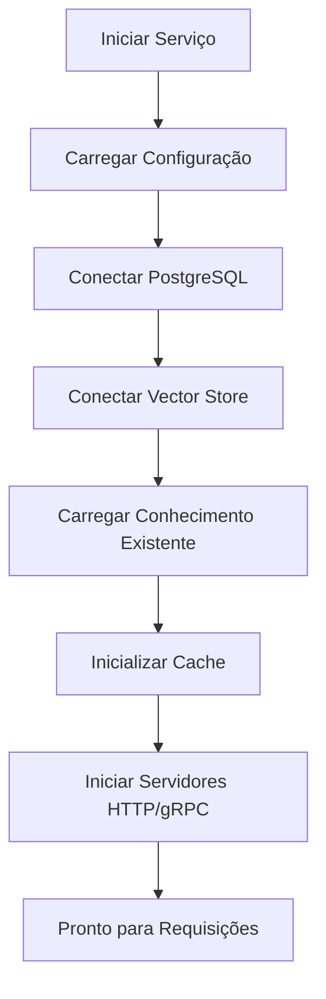
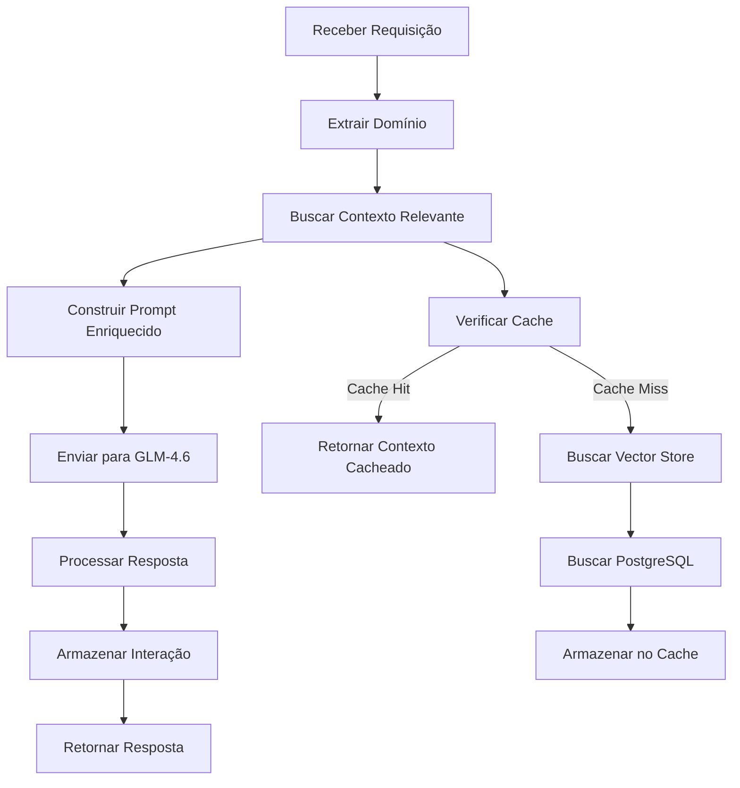
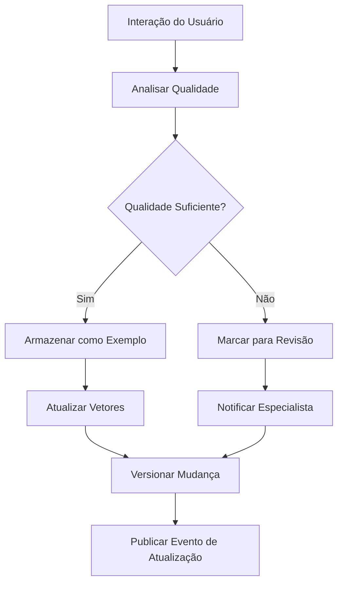

# Análise e Sugestões de Melhoria para o MCP Thor

## 📊 Análise da Estrutura Atual

### Pontos Fortes Identificados
1. **Arquitetura Limpa Consistente** - Segue rigorosamente os princípios de Clean Architecture
2. **Separação de Responsabilidades** - Camadas bem definidas (domain, application, infrastructure, interfaces)
3. **Múltiplos Templates** - Suporte para Go, TinyGo, Rust WASM e Web
4. **Integração Completa** - NATS, PostgreSQL, Redis, Prometheus
5. **IA Integrada** - GLM-4.6 Z.ai com especialistas especializados

### Gaps Identificados
1. **Falta de persistência de conhecimento** entre sessões da IA
2. **Busca semântica limitada** para recuperação de contexto
3. **Gerenciamento de estado** não centralizado
4. **Monitoramento de IA** insuficiente
5. **Versionamento de conhecimento** não implementado

---

## 🌳 Árvore de Diretórios Sugerida (Versão Aprimorada)

```
mcp-thor/
├── cmd/                                                    # 🚀 Entry Points
│   ├── main.go                                           # Servidor HTTP principal
│   ├── mcp-cli/                                          # CLI MCP
│   │   └── main.go                                       # Função: Interface CLI para operações MCP
│   ├── mcp-server/                                       # Servidor MCP dedicado
│   │   └── main.go                                       # Função: Servidor MCP protocol
│   ├── thor/                                             # CLI principal
│   │   └── main.go                                       # Função: CLI principal Thor
│   └── thor-ai/                                          # Versão IA-enhanced
│       └── main.go                                       # Função: CLI com IA integrada
│
├── internal/                                              # 🔧 Código Aplicativo Privado
│   ├── ai/                                               # 🤖 Subsistema de IA
│   │   ├── finetuning/                                   # Fine-tuning e aprendizado
│   │   │   ├── knowledge_store.go                        # Função: Armazenamento persistente de conhecimento
│   │   │   ├── prompt_builder.go                         # Função: Construção de prompts enriquecidos
│   │   │   ├── memory_manager.go                         # Função: Gerenciamento de memória persistente
│   │   │   └── versioning.go                             # Função: Versionamento de conhecimento
│   │   ├── specialist/                                   # Especialistas de IA
│   │   │   ├── glm_specialist.go                         # Função: Integração com GLM-4.6
│   │   │   ├── domain_expert.go                          # Função: Especialista em domínio
│   │   │   └── code_reviewer.go                          # Função: Revisor de código
│   │   ├── local_knowledge/                              # 🧠 Conhecimento Local
│   │   │   ├── domain_knowledge.go                       # Função: Gerenciamento de conhecimento de domínio
│   │   │   ├── business_rules.go                         # Função: Regras de negócio
│   │   │   ├── context_cache.go                          # Função: Cache de contexto
│   │   │   └── semantic_search.go                        # Função: Busca semântica
│   │   └── monitoring/                                   # 📊 Monitoramento de IA
│   │       ├── metrics_collector.go                      # Função: Coleta de métricas de IA
│   │       ├── performance_tracker.go                    # Função: Rastreamento de performance
│   │       └── quality_analyzer.go                       # Função: Análise de qualidade de respostas
│   │
│   ├── application/                                       # 📋 Camada de Aplicação
│   │   ├── use_cases/                                    # Casos de Uso
│   │   │   ├── mcp_generation.go                         # Função: Geração de MCPs
│   │   │   ├── template_management.go                    # Função: Gerenciamento de templates
│   │   │   ├── project_validation.go                     # Função: Validação de projetos
│   │   │   └── ai_assistance.go                          # Função: Assistência por IA
│   │   ├── ports/                                        # Interfaces de saída
│   │   │   ├── mcp_repository.go                         # Função: Repositório de MCPs
│   │   │   ├── template_repository.go                     # Função: Repositório de templates
│   │   │   └── ai_repository.go                          # Função: Repositório de IA
│   │   └── dtos/                                         # Data Transfer Objects
│   │       ├── mcp_dto.go                                # Função: DTOs para MCPs
│   │       ├── template_dto.go                            # Função: DTOs para templates
│   │       └── ai_dto.go                                 # Função: DTOs para IA
│   │
│   ├── domain/                                           # 💎 Camada de Domínio
│   │   ├── entities/                                     # Entidades de negócio
│   │   │   ├── mcp.go                                    # Função: Entidade MCP
│   │   │   ├── template.go                               # Função: Entidade Template
│   │   │   ├── project.go                                # Função: Entidade Project
│   │   │   └── knowledge.go                              # Função: Entidade Knowledge
│   │   ├── value_objects/                                # Objetos de Valor
│   │   │   ├── feature.go                                # Função: Feature de projeto
│   │   │   ├── technology.go                             # Função: Stack tecnológica
│   │   │   └── validation_rule.go                        # Função: Regra de validação
│   │   ├── repositories/                                 # Interfaces de repositórios
│   │   │   ├── mcp_repository.go                          # Função: Interface repositório MCP
│   │   │   ├── template_repository.go                     # Função: Interface repositório Template
│   │   │   └── knowledge_repository.go                   # Função: Interface repositório Knowledge
│   │   └── services/                                     # Serviços de domínio
│   │       ├── mcp_service.go                            # Função: Serviço de domínio MCP
│   │       ├── template_service.go                       # Função: Serviço de domínio Template
│   │       └── knowledge_service.go                      # Função: Serviço de domínio Knowledge
│   │
│   ├── infrastructure/                                   # 🏗️ Camada de Infraestrutura
│   │   ├── persistence/                                  # Persistência de dados
│   │   │   ├── postgres/                                 # PostgreSQL
│   │   │   │   ├── mcp_repository.go                     # Função: Implementação PostgreSQL MCP
│   │   │   │   ├── template_repository.go                # Função: Implementação PostgreSQL Template
│   │   │   │   └── knowledge_repository.go               # Função: Implementação PostgreSQL Knowledge
│   │   │   ├── vector_store/                             # Armazenamento vetorial
│   │   │   │   ├── chroma_store.go                       # Função: Implementação ChromaDB
│   │   │   │   ├── pinecone_store.go                     # Função: Implementação Pinecone
│   │   │   │   └── in_memory_store.go                    # Função: Implementação em memória
│   │   │   └── cache/                                    # Cache
│   │   │       ├── redis_cache.go                        # Função: Implementação Redis
│   │   │       └── memory_cache.go                       # Função: Implementação em memória
│   │   ├── messaging/                                    # Mensageria
│   │   │   ├── nats/                                     # NATS JetStream
│   │   │   │   ├── publisher.go                          # Função: Publicador NATS
│   │   │   │   ├── subscriber.go                         # Função: Consumidor NATS
│   │   │   │   └── stream_manager.go                     # Função: Gerenciador de streams
│   │   │   └── event_store/                              # Event Store
│   │   │       ├── event_store.go                        # Função: Armazenamento de eventos
│   │   │       └── snapshot_store.go                      # Função: Armazenamento de snapshots
│   │   ├── http/                                         # Clientes HTTP
│   │   │   ├── glm_client.go                             # Função: Cliente GLM-4.6
│   │   │   ├── github_client.go                          # Função: Cliente GitHub API
│   │   │   └── gitlab_client.go                          # Função: Cliente GitLab API
│   │   └── observability/                                # Observabilidade
│   │       ├── prometheus/                               # Métricas Prometheus
│   │       │   ├── metrics.go                            # Função: Coleta de métricas
│   │       │   └── exporter.go                           # Função: Exportador de métricas
│   │       ├── jaeger/                                   # Tracing Jaeger
│   │       │   ├── tracer.go                             # Função: Configuração de tracing
│   │       │   └── span.go                               # Função: Gerenciamento de spans
│   │       └── logging/                                  # Logging estruturado
│   │           ├── logger.go                             # Função: Configuração de logger
│   │           └── middleware.go                         # Função: Middleware de logging
│   │
│   ├── interfaces/                                       # 🌐 Camada de Interfaces
│   │   ├── http/                                         # Handlers HTTP
│   │   │   ├── mcp_handler.go                            # Função: Handler para MCPs
│   │   │   ├── template_handler.go                       # Função: Handler para templates
│   │   │   ├── ai_handler.go                             # Função: Handler para IA
│   │   │   └── middleware/                               # Middleware HTTP
│   │   │       ├── auth.go                               # Função: Middleware de autenticação
│   │   │       ├── cors.go                               # Função: Middleware CORS
│   │   │       └── rate_limit.go                         # Função: Middleware rate limiting
│   │   ├── grpc/                                         # Handlers gRPC
│   │   │   ├── mcp_service.go                            # Função: Serviço gRPC MCP
│   │   │   ├── template_service.go                       # Função: Serviço gRPC Template
│   │   │   └── ai_service.go                             # Função: Serviço gRPC IA
│   │   ├── cli/                                          # Comandos CLI
│   │   │   ├── root.go                                   # Função: Comando raiz
│   │   │   ├── generate.go                               # Função: Comando generate
│   │   │   ├── template.go                               # Função: Comando template
│   │   │   ├── ai.go                                     # Função: Comando ai
│   │   │   └── knowledge.go                              # Função: Comando knowledge
│   │   └── messaging/                                     # Consumidores de mensagens
│   │       ├── mcp_events_handler.go                     # Função: Handler eventos MCP
│   │       ├── ai_events_handler.go                      # Função: Handler eventos IA
│   │       └── system_events_handler.go                   # Função: Handler eventos sistema
│   │
│   ├── mcp/                                              # 📦 Lógica Específica MCP
│   │   ├── protocol/                                     # Protocolo MCP
│   │   │   ├── server.go                                 # Função: Servidor MCP
│   │   │   ├── client.go                                 # Função: Cliente MCP
│   │   │   └── tools.go                                 # Função: Definição de tools
│   │   ├── generators/                                   # Geradores
│   │   │   ├── go_generator.go                          # Função: Gerador Go
│   │   │   ├── tinygo_generator.go                      # Função: Gerador TinyGo
│   │   │   ├── rust_generator.go                        # Função: Gerador Rust
│   │   │   └── web_generator.go                          # Função: Gerador Web
│   │   └── validators/                                   # Validadores
│   │       ├── structure_validator.go                    # Função: Validação de estrutura
│   │       ├── code_validator.go                        # Função: Validação de código
│   │       └── dependency_validator.go                   # Função: Validação de dependências
│   │
│   ├── services/                                         # ⚙️ Serviços de Negócio
│   │   ├── mcp_service.go                                # Função: Serviço de MCPs
│   │   ├── template_service.go                           # Função: Serviço de templates
│   │   ├── ai_service.go                                 # Função: Serviço de IA
│   │   ├── knowledge_service.go                          # Função: Serviço de conhecimento
│   │   └── monitoring_service.go                         # Função: Serviço de monitoramento
│   │
│   ├── core/                                             # 🎯 Serviços Core
│   │   ├── config/                                       # Configuração
│   │   │   ├── config.go                                 # Função: Carregamento de configuração
│   │   │   ├── validation.go                             # Função: Validação de configuração
│   │   │   └── environment.go                           # Função: Gerenciamento de ambiente
│   │   ├── security/                                     # Segurança
│   │   │   ├── auth.go                                   # Função: Autenticação
│   │   │   ├── encryption.go                             # Função: Criptografia
│   │   │   └── rbac.go                                   # Função: Controle de acesso
│   │   └── utils/                                        # Utilitários
│   │       ├── file_utils.go                             # Função: Utilitários de arquivo
│   │       ├── string_utils.go                           # Função: Utilitários de string
│   │       └── validation_utils.go                       # Função: Utilitários de validação
│   │
│   └── cli/                                              # 💻 CLI Commands
│       ├── analytics/                                    # Comandos de analytics
│       │   ├── metrics.go                                # Função: Exibir métricas
│       │   └── performance.go                            # Função: Análise de performance
│       ├── ci/                                           # Comandos CI/CD
│       │   ├── build.go                                  # Função: Build
│       │   ├── test.go                                   # Função: Test
│       │   └── deploy.go                                 # Função: Deploy
│       ├── config/                                       # Comandos de configuração
│       │   ├── show.go                                   # Função: Mostrar configuração
│       │   ├── validate.go                               # Função: Validar configuração
│       │   └── set.go                                    # Função: Definir configuração
│       ├── repo/                                         # Comandos de repositório
│       │   ├── init.go                                   # Função: Inicializar repositório
│       │   ├── clone.go                                  # Função: Clonar repositório
│       │   └── sync.go                                   # Função: Sincronizar repositório
│       └── server/                                       # Comandos de servidor
│           ├── start.go                                  # Função: Iniciar servidor
│           ├── stop.go                                   # Função: Parar servidor
│           └── status.go                                 # Função: Status do servidor
│
├── templates/                                            # 📋 Templates de Geração
│   ├── go/                                               # Template Go (Clean Arch)
│   │   ├── cmd/                                          # Entry points
│   │   │   └── __NAME__/                                # Nome do projeto
│   │   │       └── main.go                              # Função: Ponto de entrada principal
│   │   ├── internal/                                     # Código interno
│   │   │   ├── domain/                                  # Camada de domínio
│   │   │   │   ├── entities/                            # Entidades
│   │   │   │   │   └── __ENTITY__.go                    # Função: Template de entidade
│   │   │   │   └── repositories/                         # Interfaces
│   │   │   │       └── __ENTITY___repository.go         # Função: Template de repositório
│   │   │   ├── application/                             # Camada de aplicação
│   │   │   │   ├── use_cases/                           # Casos de uso
│   │   │   │   │   └── __USE_CASE__.go                  # Função: Template de caso de uso
│   │   │   │   ├── ports/                               # Portas
│   │   │   │   │   └── __PORT__.go                      # Função: Template de porta
│   │   │   │   └── dtos/                                # DTOs
│   │   │   │       └── __DTO__.go                       # Função: Template de DTO
│   │   │   ├── infrastructure/                          # Camada de infraestrutura
│   │   │   │   ├── persistence/                         # Persistência
│   │   │   │   │   └── __ENTITY___repository_impl.go    # Função: Template de repositório
│   │   │   │   ├── messaging/                           # Mensageria
│   │   │   │   │   └── __EVENT___handler.go             # Função: Template de handler
│   │   │   │   └── http/                                # HTTP
│   │   │   │       └── __ENTITY___handler.go            # Função: Template de handler HTTP
│   │   │   └── interfaces/                              # Camada de interfaces
│   │   │       ├── http/                                # Handlers HTTP
│   │   │       │   └── __ENTITY___handler.go            # Função: Template de handler
│   │   │       └── grpc/                                # Handlers gRPC
│   │   │           └── __ENTITY___service.go             # Função: Template de serviço gRPC
│   │   ├── configs/                                      # Configurações
│   │   │   ├── dev.yaml                                 # Função: Configuração desenvolvimento
│   │   │   ├── prod.yaml                                # Função: Configuração produção
│   │   │   └── test.yaml                                # Função: Configuração testes
│   │   ├── deployments/                                  # Deployments
│   │   │   ├── docker/                                  # Docker
│   │   │   │   ├── Dockerfile                           # Função: Build Docker
│   │   │   │   └── docker-compose.yml                   # Função: Compose local
│   │   │   └── k8s/                                     # Kubernetes
│   │   │       ├── deployment.yaml                       # Função: Deployment K8s
│   │   │       └── service.yaml                         # Função: Service K8s
│   │   ├── scripts/                                      # Scripts
│   │   │   ├── build.sh                                 # Função: Script de build
│   │   │   ├── test.sh                                  # Função: Script de testes
│   │   │   └── deploy.sh                                # Função: Script de deploy
│   │   ├── tests/                                        # Testes
│   │   │   ├── unit/                                    # Testes unitários
│   │   │   │   └── __ENTITY___test.go                   # Função: Template de teste unitário
│   │   │   └── integration/                             # Testes de integração
│   │   │       └── __ENTITY___integration_test.go        # Função: Template de teste integração
│   │   ├── .github/                                      # GitHub Actions
│   │   │   └── workflows/                                # Workflows
│   │   │       ├── ci.yml                                # Função: Pipeline CI
│   │   │       ├── cd.yml                                # Função: Pipeline CD
│   │   │       └── security.yml                          # Função: Pipeline segurança
│   │   ├── go.mod                                        # Módulo Go
│   │   ├── Makefile                                      # Automação de build
│   │   └── .golangci.yml                                 # Configuração linting
│   │
│   ├── tinygo/                                           # Template TinyGo WASM
│   │   ├── cmd/                                          # Entry point
│   │   │   └── __NAME__/                                # Nome do projeto
│   │   │       └── main.go                              # Função: Ponto de entrada WASM
│   │   ├── internal/                                     # Código interno
│   │   │   ├── domain/                                  # Lógica de domínio
│   │   │   │   └── entities.go                          # Função: Entidades WASM
│   │   │   └── wasm/                                    # Bindings WASM
│   │   │       ├── js.go                                 # Função: Bindings JavaScript
│   │   │       └── exports.go                            # Função: Exportações WASM
│   │   ├── web/                                          # Frontend
│   │   │   ├── index.html                               # Função: Página principal
│   │   │   ├── wasm.js                                   # Função: Loader WASM
│   │   │   └── styles.css                                # Função: Estilos
│   │   ├── tests/                                        # Testes
│   │   │   └── wasm_test.go                             # Função: Testes WASM
│   │   ├── Makefile                                      # Build TinyGo
│   │   └── go.mod                                        # Módulo Go
│   │
│   ├── wasm/                                             # Template Rust WASM
│   │   ├── src/                                          # Código Rust
│   │   │   ├── lib.rs                                    # Função: Biblioteca principal
│   │   │   ├── utils.rs                                  # Função: Utilitários
│   │   │   └── types.rs                                  # Função: Tipos personalizados
│   │   ├── www/                                          # Frontend wrapper
│   │   │   ├── index.html                                # Função: Página principal
│   │   │   ├── wasm.js                                   # Função: Loader WASM
│   │   │   └── styles.css                                # Função: Estilos
│   │   ├── tests/                                        # Testes
│   │   │   └── lib_test.rs                              # Função: Testes Rust
│   │   ├── Cargo.toml                                    # Dependências Rust
│   │   └── build.sh                                      # Script de build
│   │
│   └── web/                                              # Template React/Vite
│       ├── src/                                          # Código fonte
│       │   ├── components/                               # Componentes React
│       │   │   ├── ui/                                   # Componentes UI
│       │   │   │   ├── Button.tsx                        # Função: Componente Button
│       │   │   │   ├── Input.tsx                         # Função: Componente Input
│       │   │   │   └── Modal.tsx                         # Função: Componente Modal
│       │   │   ├── forms/                                # Formulários
│       │   │   │   └── __FORM__.tsx                      # Função: Template de formulário
│       │   │   └── layouts/                              # Layouts
│       │   │       ├── Header.tsx                        # Função: Header
│       │   │       └── Sidebar.tsx                       # Função: Sidebar
│       │   ├── pages/                                    # Páginas
│       │   │   ├── Home.tsx                              # Função: Página inicial
│       │   │   ├── __PAGE__.tsx                          # Função: Template de página
│       │   │   └── NotFound.tsx                          # Função: Página 404
│       │   ├── hooks/                                    # Hooks personalizados
│       │   │   ├── useApi.ts                             # Função: Hook para API
│       │   │   ├── useAuth.ts                            # Função: Hook de autenticação
│       │   │   └── useLocalStorage.ts                    # Função: Hook de storage local
│       │   ├── services/                                 # Serviços
│       │   │   ├── api.ts                                # Função: Serviço de API
│       │   │   ├── auth.ts                               # Função: Serviço de autenticação
│       │   │   └── storage.ts                            # Função: Serviço de storage
│       │   ├── utils/                                    # Utilitários
│       │   │   ├── constants.ts                          # Função: Constantes
│       │   │   ├── helpers.ts                            # Função: Helpers
│       │   │   └── validators.ts                         # Função: Validadores
│       │   ├── types/                                    # Tipos TypeScript
│       │   │   ├── api.ts                                # Função: Tipos de API
│       │   │   ├── auth.ts                               # Função: Tipos de autenticação
│       │   │   └── common.ts                             # Função: Tipos comuns
│       │   ├── lib/                                      # Bibliotecas
│       │   │   ├── axios.ts                              # Função: Configuração Axios
│       │   │   └── react-query.ts                        # Função: Configuração React Query
│       │   ├── styles/                                   # Estilos
│       │   │   ├── globals.css                           # Função: Estilos globais
│       │   │   └── components.css                        # Função: Estilos de componentes
│       │   ├── test/                                     # Testes
│       │   │   ├── setup.ts                              # Função: Configuração de testes
│       │   │   └── __COMPONENT___test.tsx                # Função: Template de teste
│       │   ├── App.tsx                                   # Função: Componente principal
│       │   ├── main.tsx                                  # Função: Ponto de entrada
│       │   └── vite-env.d.ts                            # Função: Tipos Vite
│       ├── public/                                       # Assets estáticos
│       │   ├── favicon.ico                               # Função: Favicon
│       │   └── manifest.json                             # Função: Manifest PWA
│       ├── tests/                                        # Testes E2E
│       │   └── e2e/                                      # Testes E2E
│       │       └── __FEATURE__.spec.ts                   # Função: Template de teste E2E
│       ├── package.json                                  # Dependências
│       ├── vite.config.ts                                # Configuração Vite
│       ├── tailwind.config.js                            # Configuração Tailwind
│       ├── tsconfig.json                                 # Configuração TypeScript
│       └── .eslintrc.js                                  # Configuração ESLint
│
├── tools/                                                 # 🔧 Utilitários de Desenvolvimento
│   ├── schema_converter.js                               # Função: Conversão de schemas
│   ├── nats_generator.js                                 # Função: Geração de config NATS
│   ├── mcp_validator.js                                  # Função: Validação de MCPs
│   ├── ai_trainer.py                                     # Função: Treinamento de modelos IA
│   ├── performance_profiler.go                            # Função: Profiling de performance
│   └── security_scanner.go                               # Função: Scanner de segurança
│
├── config/                                                # ⚙️ Arquivos de Configuração
│   ├── features.yaml                                     # Função: Definição de features
│   ├── endurance-tree.yaml                               # Função: Estrutura do ecossistema
│   ├── nats-subjects.yaml                                # Função: Padrões NATS
│   ├── ai.yaml                                           # Função: Configuração IA
│   ├── persistence.yaml                                  # Função: Configuração persistência
│   ├── dev.yaml                                          # Função: Configuração desenvolvimento
│   ├── prod.yaml                                         # Função: Configuração produção
│   └── test.yaml                                         # Função: Configuração testes
│
├── scripts/                                              # 📜 Scripts de Automação
│   ├── setup-thor-blueprint.ps1                          # Função: Setup do blueprint
│   ├── setup-endurance-structure.ps1                     # Função: Setup estrutura Endurance
│   ├── generate-mcp.ps1                                  # Função: Geração de MCP
│   ├── validate-mcp.ps1                                  # Função: Validação de MCP
│   ├── setup-ai-knowledge.ps1                            # Função: Setup conhecimento IA
│   ├── deploy.sh                                         # Função: Deploy
│   ├── backup.sh                                         # Função: Backup
│   └── cleanup.sh                                        # Função: Limpeza
│
└── docs/                                                  # 📚 Documentação
    ├── architecture/                                     # Arquitetura
    │   ├── blueprint.md                                  # Função: Documento de arquitetura
    │   ├── clean_architecture.md                         # Função: Guia Clean Architecture
    │   ├── ai_integration.md                            # Função: Integração IA
    │   └── nats_integration.md                          # Função: Integração NATS
    ├── api/                                              # API Documentation
    │   ├── openapi.yaml                                  # Função: Especificação OpenAPI
    │   ├── asyncapi.yaml                                 # Função: Especificação AsyncAPI
    │   └── grpc.md                                       # Função: Documentação gRPC
    ├── guides/                                           # Guias
    │   ├── getting_started.md                            # Função: Guia de início
    │   ├── development.md                                # Função: Guia de desenvolvimento
    │   ├── deployment.md                                 # Função: Guia de deploy
    │   └── troubleshooting.md                            # Função: Solução de problemas
    ├── examples/                                         # Exemplos
    │   ├── inventory_schema.json                         # Função: Schema de exemplo
    │   ├── order_flow.md                                 # Função: Exemplo de fluxo
    │   └── ai_prompts.md                                 # Função: Exemplos de prompts
    └── validation/                                       # Validação
        ├── criteria.md                                   # Função: Critérios de validação
        ├── reports/                                      # Relatórios de validação
        └── raw/                                          # Dados brutos de validação
```

---

## 🔧 Principais Melhorias Sugeridas

### 1. **Sistema de Conhecimento Persistente**

#### Novo Componente: `internal/ai/local_knowledge/`

```go
// internal/ai/local_knowledge/domain_knowledge.go
type DomainKnowledge struct {
    ID          string                 `json:"id"`
    Domain      string                 `json:"domain"`
    Concepts    map[string]Concept     `json:"concepts"`
    Rules       []BusinessRule         `json:"rules"`
    Examples    []Example              `json:"examples"`
    Version     string                 `json:"version"`
    LastUpdated time.Time              `json:"last_updated"`
    Metadata    map[string]interface{} `json:"metadata"`
}

// Função: Armazenar e recuperar conhecimento específico do domínio
// Integrações: PostgreSQL, Redis, Vector Store
```

#### Novo Componente: `internal/ai/finetuning/`

```go
// internal/ai/finetuning/memory_manager.go
type MemoryManager struct {
    store     local_knowledge.KnowledgeStore
    vectorDB  persistence.VectorStore
    cache     persistence.Cache
    maxSize   int
    ttl       time.Duration
}

// Função: Gerenciar memória persistente entre sessões
// Integrações: ChromaDB/Pinecone, Redis, PostgreSQL
```

### 2. **Busca Semântica Avançada**

#### Novo Componente: `internal/infrastructure/persistence/vector_store/`

```go
// internal/infrastructure/persistence/vector_store/chroma_store.go
type ChromaStore struct {
    client    *chromadb.Client
    collection string
    embedding model.EmbeddingModel
}

// Função: Busca semântica de conhecimento relevante
// Integrações: ChromaDB, OpenAI Embeddings, Sentence Transformers
```

### 3. **Monitoramento de IA**

#### Novo Componente: `internal/ai/monitoring/`

```go
// internal/ai/monitoring/metrics_collector.go
type AIMetricsCollector struct {
    prometheus prometheus.Registerer
    jaeger    opentracing.Tracer
    logger    logger.Logger
}

// Função: Coletar métricas de performance e qualidade da IA
// Integrações: Prometheus, Jaeger, OpenTelemetry
```

### 4. **Versionamento de Conhecimento**

#### Novo Componente: `internal/ai/finetuning/versioning.go`

```go
// internal/ai/finetuning/versioning.go
type KnowledgeVersionManager struct {
    store     local_knowledge.KnowledgeStore
    gitRepo   *git.Repository
    validator *KnowledgeValidator
}

// Função: Versionar e validar alterações no conhecimento
// Integrações: Git, PostgreSQL, Event Store
```

### 5. **Cache Inteligente**

#### Novo Componente: `internal/ai/local_knowledge/context_cache.go`

```go
// internal/ai/local_knowledge/context_cache.go
type ContextCache struct {
    redis     *redis.Client
    local     *sync.Map
    ttl       time.Duration
    maxSize   int
}

// Função: Cache de contexto com invalidação inteligente
// Integrações: Redis, Memória local, Eventos NATS
```

---

## 🔄 Fluxo de Trabalho Aprimorado

### 1. **Inicialização com Conhecimento Persistente**



### 2. **Processamento de Requisição com Contexto**



### 3. **Aprendizado Contínuo**



---

## 📊 Benefícios das Melhorias

### 1. **Persistência de Conhecimento**
- ✅ Conhecimento mantido entre sessões
- ✅ Histórico completo de interações
- ✅ Recuperação rápida de contexto relevante

### 2. **Busca Semântica**
- ✅ Encontrar conhecimento por significado, não apenas palavras
- ✅ Contexto mais relevante para as respostas
- ✅ Melhor compreensão de intenções

### 3. **Monitoramento Avançado**
- ✅ Métricas de performance da IA
- ✅ Qualidade das respostas
- ✅ Identificação de padrões de uso

### 4. **Versionamento**
- ✅ Controle de alterações no conhecimento
- ✅ Rollback para versões anteriores
- ✅ Auditoria completa

### 5. **Cache Inteligente**
- ✅ Respostas mais rápidas
- ✅ Redução de carga na API
- ✅ Invalidação automática

---

## 🚀 Implementação Prioritária

### Fase 1 (Imediata)
1. Implementar `local_knowledge/` básico
2. Configurar Vector Store (ChromaDB)
3. Implementar cache Redis

### Fase 2 (Curto Prazo)
1. Implementar busca semântica
2. Adicionar monitoramento básico
3. Implementar versionamento simples

### Fase 3 (Médio Prazo)
1. Sistema completo de fine-tuning
2. Monitoramento avançado
3. Dashboard de conhecimento

### Fase 4 (Longo Prazo)
1. Auto-aprendizado
2. Geração automática de conhecimento
3. Sistema de recomendação

---

## 🔧 Scripts de Setup

### Script para Configuração do Sistema de Conhecimento

```powershell
# scripts/setup-ai-knowledge.ps1
param(
    [Parameter(Mandatory=$true)]
    [string]$InstallPath,
    
    [Parameter(Mandatory=$false)]
    [string]$ConfigPath = ".\config\ai.yaml"
)

Write-Host "Configurando sistema de conhecimento persistente..." -ForegroundColor Green

# Criar estrutura de diretórios
$dirs = @(
    "$InstallPath\internal\ai\local_knowledge",
    "$InstallPath\internal\ai\finetuning",
    "$InstallPath\internal\ai\monitoring",
    "$InstallPath\internal\infrastructure\persistence\vector_store",
    "$InstallPath\internal\infrastructure\persistence\cache"
)

foreach ($dir in $dirs) {
    New-Item -ItemType Directory -Force -Path $dir | Out-Null
}

# Copiar arquivos de configuração
Copy-Item -Path ".\config\ai.yaml" -Destination "$InstallPath\config\ai.yaml" -Force
Copy-Item -Path ".\config\persistence.yaml" -Destination "$InstallPath\config\persistence.yaml" -Force

# Instalar dependências
Write-Host "Instalando dependências..." -ForegroundColor Yellow
go get github.com/chromedp/chromedp
go get github.com/go-redis/redis/v8
go get github.com/lib/pq
go get github.com/jackc/pgx/v4
go get github.com/prometheus/client_golang
go get github.com/open-telemetry/opentelemetry-go

Write-Host "Configuração concluída!" -ForegroundColor Green
```

---

## 📋 Checklist de Validação

### Funcionalidades Essenciais
- [ ] Persistência de conhecimento funcionando
- [ ] Busca semântica operacional
- [ ] Cache configurado e funcionando
- [ ] Monitoramento básico implementado
- [ ] Versionamento de conhecimento

### Integrações
- [ ] PostgreSQL conectado e migrado
- [ ] Redis configurado e funcionando
- [ ] ChromaDB instalado e acessível
- [ ] GLM-4.6 API conectada
- [ ] NATS configurado para eventos

### Testes
- [ ] Testes unitários para novos componentes
- [ ] Testes de integração com persistência
- [ ] Testes de carga para cache
- [ ] Testes de busca semântica
- [ ] Testes de versionamento

Essa estrutura aprimorada proporciona uma base sólida para um sistema de IA com conhecimento persistente, aprendizado contínuo e monitoramento avançado, mantendo a qualidade e consistência da arquitetura existente.