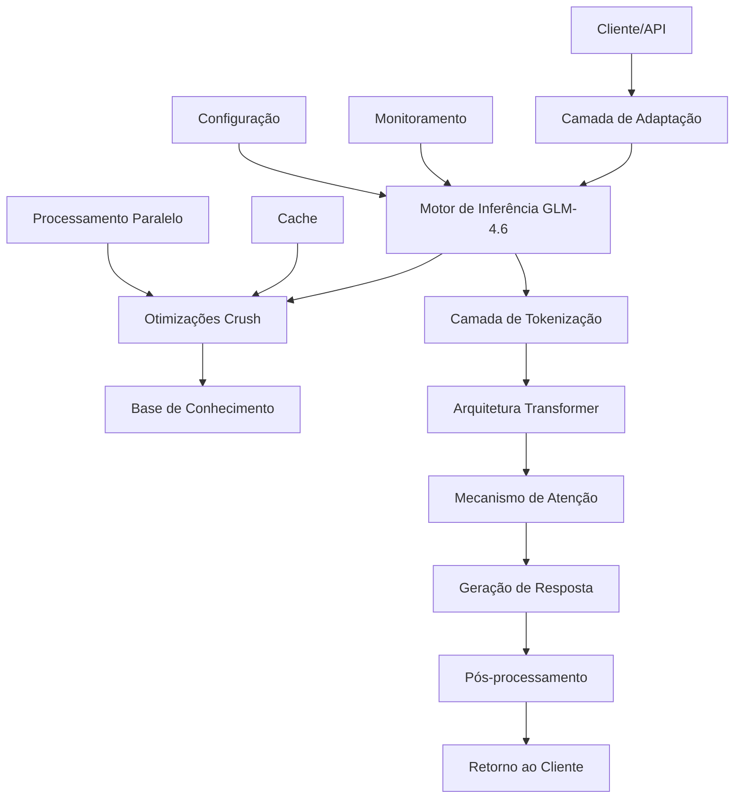

# 📘 **GLM-4.6 BLUEPRINT — IMPLEMENTAÇÃO COM CRUSH**

**STATUS:** Oficial • Versão 1.0 • Fonte única da verdade
**PILAR:** Modelo de Linguagem / Processamento de Linguagem Natural
**APROVAÇÃO:** Arquitetura GLM-4.6

---

## **1. Propósito do GLM-4.6 com Crush**

O **GLM-4.6 com Crush** é uma implementação otimizada do modelo de linguagem GLM-4.6 que visa:

* Processamento de linguagem natural de alta performance
* Geração de respostas coerentes e contextualizadas
* Capacidade de raciocínio sobre múltiplos domínios
* Integração eficiente com sistemas externos (MCP, APIs, bancos de dados)
* Processamento paralelo e distribuído para grandes volumes de dados
* Adaptabilidade para diferentes tarefas de NLP (tradução, resumo, geração de código, etc.)

**O GLM-4.6 com Crush combina a arquitetura Transformer avançada com técnicas de otimização Crush para maximizar throughput e minimizar latência.**

---

## **2. Escopo e Responsabilidades**

### **2.1. Responsabilidades Gerais**

O GLM-4.6 com Crush executa as seguintes funções:

| Função | Descrição |
| ------ | --------- |
| **Processamento de Linguagem** | Compreensão e geração de texto em múltiplos idiomas |
| **Raciocínio Contextual** | Manutenção de contexto em conversas longas |
| **Geração de Código** | Criação de código em diversas linguagens de programação |
| **Análise Semântica** | Extração de significado e intenções do texto |
| **Processamento Paralelo** | Execução distribuída para aumentar throughput |
| **Adaptação de Domínio** | Especialização para diferentes áreas de conhecimento |
| **Integração MCP** | Comunicação eficiente com o protocolo MCP |
| **Otimização de Recursos** | Uso eficiente de CPU/GPU/memória |

---

## **3. Estrutura Física Oficial**

```
GLM-4.6 — IMPLEMENTAÇÃO COM CRUSH
├── cmd/
│   ├── main.go                          # Servidor principal GLM-4.6
│   ├── api_server/main.go               # Servidor de API REST
│   ├── cli/main.go                      # Interface de linha de comando
│   └── benchmark/main.go                # Ferramenta de benchmark
│
├── internal/
│   ├── core/                            # Núcleo do modelo GLM-4.6
│   │   ├── transformer/                  # Arquitetura Transformer otimizada
│   │   │   ├── attention.go             # Mecanismo de atenção multi-cabeça
│   │   │   ├── feedforward.go           # Redes feed-forward
│   │   │   ├── embeddings.go            # Camada de embeddings
│   │   │   └── positional_encoding.go   # Codificação posicional
│   │   │
│   │   ├── crush/                       # Otimizações Crush
│   │   │   ├── parallel_processor.go    # Processamento paralelo
│   │   │   ├── memory_optimizer.go      # Otimização de memória
│   │   │   ├── batch_processor.go       # Processamento em lote
│   │   │   └── cache_manager.go         # Cache de resultados
│   │   │
│   │   ├── tokenizer/                   # Tokenização
│   │   │   ├── tokenizer.go             # Interface principal
│   │   │   ├── bpe.go                  # Byte-Pair Encoding
│   │   │   └── vocab.go                # Vocabulário
│   │   │
│   │   └── inference/                   # Motor de inferência
│   │       ├── engine.go                # Motor principal
│   │       ├── beam_search.go           # Busca em feixe
│   │       ├── sampling.go              # Estratégias de amostragem
│   │       └── temperature.go           # Controle de temperatura
│   │
│   ├── knowledge/                       # Base de conhecimento
│   │   ├── knowledge_base.go            # Interface da base de conhecimento
│   │   ├── retrieval.go                 # Recuperação de informações
│   │   ├── indexing.go                  # Indexação de documentos
│   │   └── memory.go                   # Memória de curto e longo prazo
│   │
│   ├── adapters/                        # Adaptadores externos
│   │   ├── mcp/                         # Adaptador MCP
│   │   │   ├── client.go                # Cliente MCP
│   │   │   ├── handlers.go              # Handlers MCP
│   │   │   └── protocol.go              # Implementação do protocolo
│   │   │
│   │   ├── api/                         # Adaptadores de API
│   │   │   ├── rest.go                  # API REST
│   │   │   ├── graphql.go               # API GraphQL
│   │   │   └── websocket.go             # WebSocket
│   │   │
│   │   └── storage/                     # Adaptadores de armazenamento
│   │       ├── vector_db.go             # Banco de dados vetorial
│   │       ├── document_db.go           # Banco de documentos
│   │       └── cache.go                 # Cache distribuído
│   │
│   └── utils/                           # Utilitários
│       ├── logger.go                    # Sistema de logging
│       ├── metrics.go                   # Métricas e monitoramento
│       ├── config.go                    # Configuração
│       └── validation.go                # Validação de entrada/saída
│
├── pkg/                                 # Pacotes públicos
│   ├── glm/                             # Interface principal do GLM-4.6
│   │   ├── client.go                    # Cliente GLM-4.6
│   │   ├── types.go                     # Tipos e estruturas
│   │   └── errors.go                    # Erros customizados
│   │
│   ├── prompt/                          # Engenharia de prompts
│   │   ├── builder.go                   # Construtor de prompts
│   │   ├── templates.go                 # Templates de prompts
│   │   └── optimization.go              # Otimização de prompts
│   │
│   └── evaluation/                      # Avaliação de modelo
│       ├── metrics.go                   # Métricas de avaliação
│       ├── benchmarks.go                # Benchmarks
│       └── tests.go                     # Conjuntos de teste
│
├── configs/                             # Configurações
│   ├── model.yaml                       # Configuração do modelo
│   ├── crush.yaml                       # Configuração das otimizações Crush
│   ├── knowledge.yaml                   # Configuração da base de conhecimento
│   └── api.yaml                         # Configuração da API
│
├── models/                              # Modelos pré-treinados
│   ├── base/                            # Modelo base GLM-4.6
│   ├── fine_tuned/                      # Modelos fine-tuned
│   └── checkpoints/                     # Checkpoints de treinamento
│
└── scripts/                             # Scripts de automação
    ├── train.sh                         # Script de treinamento
    ├── evaluate.sh                      # Script de avaliação
    ├── deploy.sh                        # Script de deploy
    └── benchmark.sh                     # Script de benchmark
```

---

## **4. Arquitetura Técnica**

### **4.1. Diagrama — Arquitetura GLM-4.6 com Crush**



---

## **5. Componentes Principais**

### **5.1. Arquitetura Transformer Otimizada**

Implementação do Transformer com otimizações específicas:

* **Mecanismo de Atenção Multi-Cabeça**: Implementação eficiente com suporte a processamento paralelo
* **Redes Feed-Forward**: Otimizadas para reduzir latência
* **Codificação Posicional**: Adaptada para lidar com sequências longas
* **Normalização**: Técnicas avançadas de normalização para estabilidade

### **5.2. Otimizações Crush**

Conjunto de técnicas para maximizar performance:

* **Processamento Paralelo**: Distribuição eficiente de tarefas entre múltiplos núcleos/GPUs
* **Otimização de Memória**: Redução do uso de memória através de técnicas de compactação
* **Processamento em Lote**: Agrupamento inteligente de requisições para aumentar throughput
* **Cache Inteligente**: Cache de resultados e estados intermediários para evitar recomputação

### **5.3. Motor de Inferência**

Componente responsável pela geração de respostas:

* **Busca em Feixe**: Implementação otimizada para encontrar as melhores sequências
* **Estratégias de Amostragem**: Diversas técnicas (top-k, nucleus, etc.)
* **Controle de Temperatura**: Ajuste fino da criatividade vs. coerência
* **Gerenciamento de Contexto**: Manutenção eficiente de contexto em conversas longas

### **5.4. Base de Conhecimento**

Sistema para armazenar e recuperar informações relevantes:

* **Indexação Eficiente**: Estruturas otimizadas para busca rápida
* **Memória de Curto e Longo Prazo**: Diferenciação entre informações temporárias e permanentes
* **Recuperação Híbrida**: Combinação de busca vetorial e baseada em palavras-chave
* **Atualização Incremental**: Capacidade de atualizar a base sem reconstrução completa

---

## **6. Integrações Oficiais**

| ORIGEM (GLM-4.6) | DESTINO | MOTIVO |
| ---------------- | ------- | ------ |
| API REST | Clientes Externos | Interface padrão para comunicação HTTP |
| Adaptador MCP | Protocolo MCP | Integração com o ecossistema MCP |
| Vector DB | Base de Conhecimento | Armazenamento eficiente de embeddings |
| Cache Distribuído | Otimizações Crush | Redução de latência e aumento de throughput |
| Sistema de Monitoramento | Motor de Inferência | Observabilidade e ajuste de performance |

---

## **7. Regras de Qualidade (Normativas)**

### ✔ O GLM-4.6 DEVE implementar:

* Interface de API REST consistente
* Mecanismos de cache eficientes
* Processamento paralelo para aumento de throughput
* Sistema de logging estruturado
* Métricas de performance em tempo real
* Validação rigorosa de entrada/saída
* Tratamento de erros robusto

### ✔ O GLM-4.6 NÃO DEVE:

* Expor detalhes internos da arquitetura
* Manter estado global mutável
| Bloquear operações por longos períodos
| Ignorar limites de recursos
| Comprometer a privacidade dos dados

### ✔ Dependências Permitidas

* Bibliotecas de processamento de linguagem natural
| Frameworks de API (REST, GraphQL)
| Bancos de dados vetoriais
| Sistemas de cache distribuído
| Ferramentas de monitoramento

### ❌ Dependências Proibidas

* Bibliotecas com licenças incompatíveis
| Componentes que comprometam a segurança
| Dependências não mantidas ou sem suporte

---

## **8. Critérios de Conclusão (DoD)**

Para considerar o GLM-4.6 com Crush concluído:

✔ API REST funcional e documentada
✔ Motor de inferência operacional
✔ Otimizações Crush implementadas e testadas
✔ Sistema de tokenização eficiente
✔ Base de conhecimento funcional
✔ Adaptador MCP implementado
✔ Testes de performance satisfatórios
✔ Documentação completa
✔ Métricas de monitoramento configuradas

---

## **9. Status Atual**

🟡 Arquitetura definida
🟡 Estrutura básica implementada
🟡 Motor de inferência em desenvolvimento
🟡 Otimizações Crush em planejamento
🟡 Adaptador MCP pendente
🟡 Testes de performance necessários

---

## **10. Próximos Passos**

1. Implementação do motor de inferência básico
2. Desenvolvimento das otimizações Crush
3. Criação da API REST
4. Implementação do adaptador MCP
5. Integração com base de conhecimento
6. Testes de performance e otimização
7. Documentação completa
8. Deploy em ambiente de produção

---

## **11. Considerações de Implementação com Crush**

A implementação com Crush deve focar em:

* **Paralelização Massiva**: Aproveitar ao máximo múltiplos núcleos e GPUs
* **Minimização de Latência**: Técnicas para reduzir o tempo de resposta
* **Maximização de Throughput**: Processar o máximo de requisições por segundo
* **Eficiência de Memória**: Uso otimizado de recursos de memória
* **Escalabilidade Horizontal**: Capacidade de distribuir carga entre múltiplas instâncias
* **Resiliência**: Continuidade de operação mesmo sob falhas parciais

---

## **12. Métricas de Sucesso**

O sucesso da implementação será medido por:

* **Latência**: Tempo médio de resposta < 100ms para consultas simples
* **Throughput**: Capacidade de processar > 1000 requisições/segundo
* **Qualidade**: Coerência e relevância das respostas (medida por benchmarks)
* **Eficiência**: Uso otimizado de recursos (CPU, GPU, memória)
* **Disponibilidade**: Tempo de atividade > 99.9%
* **Satisfação do Usuário**: Feedback positivo dos utilizadores

---

**APROVADO POR:** Arquitetura GLM-4.6
**DATA:** 2023-11-15
**VERSÃO:** 1.0