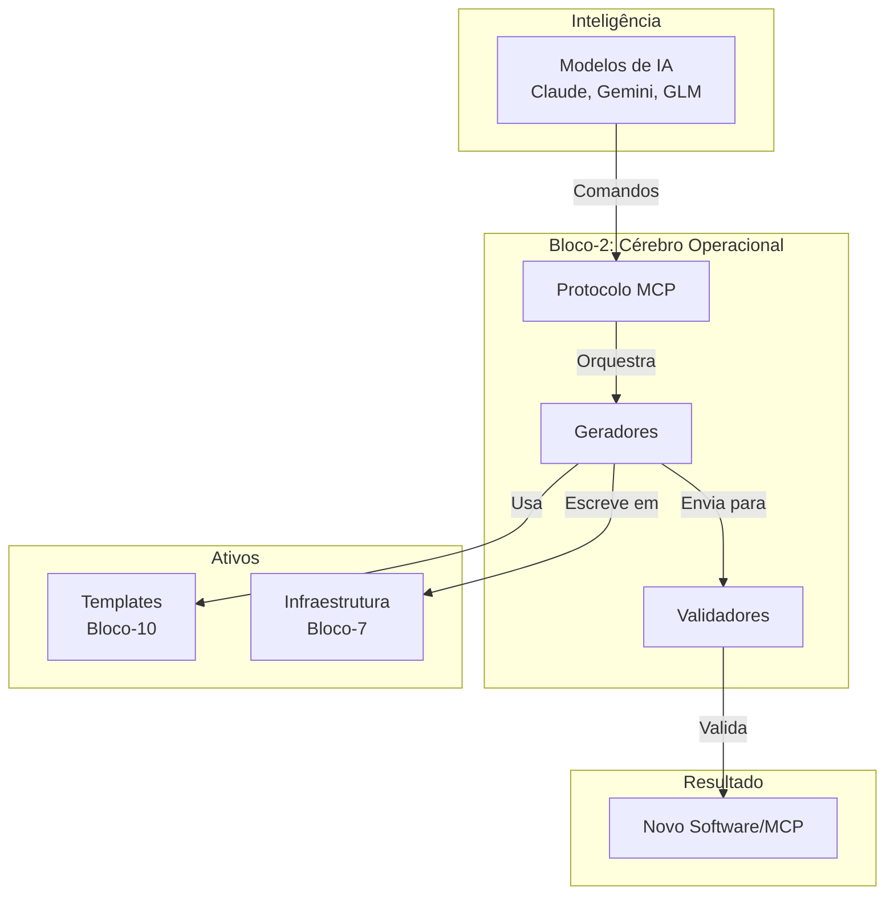

# 📘 **BLUEPRINT EXECUTIVO — BLOCO-2 (MCP Protocol & Generation)**

**STATUS:** Executivo • Versão 1.0 • Foco em Valor de Negócio
**PILAR:** Inteligência Operacional e Automação
**PÚBLICO-ALVO:** Liderança, Arquitetos, Product Managers, Stakeholders

---

## **1. Visão Estratégica**

O **Bloco-2** é o cérebro operacional que transforma o **Hulk** de uma plataforma estática para um **ecossistema vivo e autônomo**. Ele é a ponte fundamental entre a **Inteligência Artificial (IA)** e a **engenharia de software**, capacitando o sistema a não apenas executar tarefas, mas a **criar, validar e gerenciar seu próprio código e componentes**.

Sua existência responde a uma pergunta estratégica: *Como podemos escalar nossa capacidade de desenvolvimento de software exponencialmente, mantendo qualidade e consistência?* A resposta do Bloco-2 é a **automação guiada por IA**.

---

## **2. Propósito Central**

O Bloco-2 existe para **operacionalizar a geração de software sob demanda**. Ele traduz intenções (seja de um humano via CLI ou de uma IA via MCP) em artefatos de código funcionais, bem estruturados e prontos para produção.

Sua missão é quadrupla:

1.  **Comunicar-se com a IA:** Servir como o gateway oficial para que modelos como Claude, Gemini e GLM interajam com o Hulk de forma estruturada e segura.
2.  **Gerar Software Automaticamente:** Atuar como uma fábrica de código, capaz de criar novos serviços, MCPs e projetos completos a partir de templates e especificações.
3.  **Garantir Qualidade Intransigente:** Validar cada linha de código e cada estrutura de diretório gerada para garantir aderência total aos padrões arquiteturais do Hulk.
4.  **Mapear e Descobrir:** Manter um catálogo dinâmico de todos os componentes (MCPs, templates) disponíveis, permitindo auto-descoberta e orquestração.

---

## **3. Pilares de Capacidade**

O Bloco-2 é estruturado em quatro pilares fundamentais que, juntos, entregam sua promessa de valor:

| Pilar | Função Executiva | Analogia de Negócio |
| ----- | ---------------- | ------------------- |
| **Protocolo MCP** | **O Ouvido e a Voz da IA.** Permite que agentes de IA conversem com o Hulk, entendam suas capacidades e emitam comandos de forma padronizada. | O **Atendimento ao Cliente** da nossa plataforma para IAs. |
| **Geradores (Generators)** | **A Fábrica de Software.** Transforma especificações abstratas em código concreto, seguindo as melhores práticas e a arquitetura limpa. | Nossa **Linha de Montagem** digital, customizável e eficiente. |
| **Validadores (Validators)** | **O Controle de Qualidade (QA).** Inspecciona tudo o que é gerado para garantir que não há defeitos, inconsistências ou violações de padrão. | O **Departamento de Garantia de Qualidade** que não deixa nada passar. |
| **Registro (Registry)** | **O Inventário e o Catálogo.** Mantém um registro centralizado de tudo que existe e pode ser criado, permitindo descoberta e reuso. | O **Almoxarifado** inteligente dos nossos ativos de software. |

---

## **4. Valor de Negócio**

O investimento e a implementação do Bloco-2 geram retornos diretos e mensuráveis para o negócio:

### 🚀 **Aceleração Extrema do Time-to-Market**
*   **Redução de semanas para minutos.** Novos microserviços, APIs e componentes podem ser gerados em instantes, eliminando o trabalho manual repetitivo de setup (boilerplate).

### 🛡️ **Consistência e Redução de Risco**
*   **Zero desvio arquitetural.** Toda geração segue rigidamente a árvore oficial, eliminando a "dívida técnica de inovação" e a fragmentação de padrões.
*   **Qualidade assegurada por design.** O processo de validação integrado evita que código de baixa qualidade ou com falhas de segurança chegue à produção.

### 📈 **Escalabilidade Autônoma**
*   **A plataforma cresce sozinha.** O Hulk pode criar seus próprios MCPs para novas funcionalidades, permitindo que o ecossistema se expanda sem a necessidade de intervenção manual linear.
*   **Desbloqueia a força de trabalho da IA.** Integra IA generativa diretamente no ciclo de vida de desenvolvimento, multiplicando a capacidade da equipe de engenharia.

### 💡 **Foco em Valor, não em Tarefa**
*   **Libera os engenheiros.** Automatiza o trabalho de baixo valor (criação de estruturas, configurações) para que os humanos possam se concentrar na lógica de negócio complexa, na inovação e na resolução de problemas de alto impacto.

---

## **5. Fluxo de Valor Simplificado**

O processo de negócio orquestrado pelo Bloco-2 é simples e poderoso:

```mermaid
flowchart LR
    A[Requisição<br>(IA / Humano)] --> B[Bloco-2:<br>Protocolo MCP]
    B --> C[Bloco-2:<br>Geradores]
    C --> D[Bloco-2:<br>Validadores]
    D --> E[Resultado:<br>Software Validado]
    E --> F[Bloco-2:<br>Registry]
    F --> G[Componente<br>Disponível e Rastreável]
```

---

## **6. Princípios Diretores**

*   **Automation First:** Se pode ser automatizado, será.
*   **Quality by Design:** A qualidade não é um passo final, é intrínseca ao processo.
*   **AI-Native:** Projetado desde o primeiro dia para ser operado por agentes de IA.
*   **Pluggable & Extensible:** Fácil adicionar novos geradores, validadores e ferramentas MCP sem alterar o núcleo.

---

## **7. Posicionamento no Ecossistema Hulk**

O Bloco-2 é o **tradutor central** que conecta a intenção à execução.



---

## **8. Conclusão e Próximos Passos**

O **Bloco-2 não é um módulo de software; é uma alavanca estratégica**. Ele representa a mudança de paradigma de *construir software manualmente* para *orquestrar a criação de software de forma inteligente e autônoma*.

**Próximos Passos Recomendados:**
1.  **Priorizar a Implementação:** Focar no desenvolvimento do Protocolo MCP e do primeiro Gerador (ex: Go).
2.  **Definir o MVP de Validação:** Estabelecer as regras críticas de qualidade que devem ser aplicadas.
3.  **Piloto Interno:** Utilizar o Bloco-2 para gerar um novo serviço interno para validar o ciclo completo e demonstrar o valor.

---

**APROVADO POR:** Arquitetura Estratégica Hulk
**DATA:** 2023-11-15
**VERSÃO:** 1.0