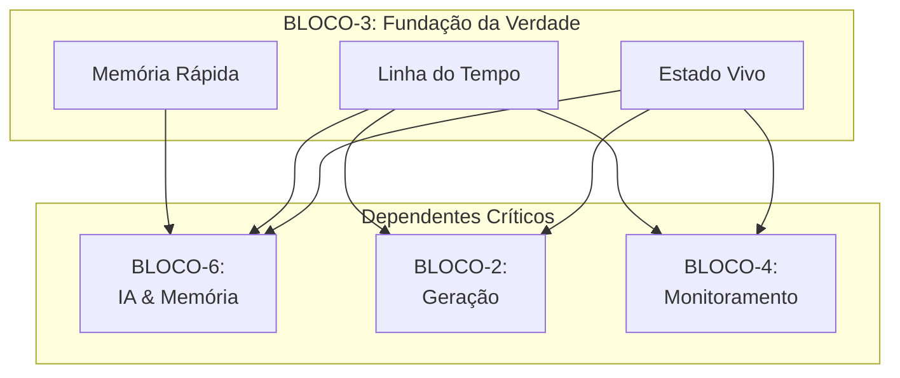

# 📘 **BLUEPRINT EXECUTIVO — BLOCO-3 (STATE MANAGEMENT)**

**STATUS:** Executivo • Versão 1.0 • Foco em Valor de Negócio
**PILAR:** Consistência, Resiliência e Auditoria
**PÚBLICO-ALVO:** Liderança, Arquitetos, Product Managers, Stakeholders

---

## **⚠️ Atenção: Correção Importante**

O **BLOCO-3** é oficialmente **STATE MANAGEMENT (Gerenciamento de Estado)**, não "MCP Protocol & Generation". Essa funcionalidade pertence ao **BLOCO-2**.

Este documento aborda o **valor estratégico e o propósito do Bloco-3**, que é a fundação de consistência e confiabilidade de todo o ecossistema Hulk.

---

## **1. Visão Estratégica**

O **Bloco-3** é a **espinha dorsal digital e o sistema nervoso central** do Hulk. Em um mundo de sistemas distribuídos, microserviços e interações assíncronas, garantir que todos os componentes vejam a mesma "verdade" ao mesmo tempo é o maior desafio para a confiabilidade. O Bloco-3 resolve esse problema de forma fundamental.

Ele não gera código nem se comunica com a IA diretamente; ele **garante que o estado do sistema — quem fez o quê, quando, e qual é o resultado atual — seja sempre preciso, recuperável e imutavelmente registrado**. Sem ele, o Hulk seria um ecossistema de caos, onde a perda de dados ou inconsistências seriam a norma, não a exceção.

---

## **2. Propósito Central**

O Bloco-3 existe para ser a **fonte única e infalível da verdade** do estado do sistema. Sua missão é quádrupla:

1.  **Garantir a Verdade Única:** Assegurar que, a qualquer momento, todos os módulos operem com uma visão consistente e versionada do estado atual, eliminando conflitos de dados.
2.  **Prover Resiliência e Auditoria:** Manter um registro imutável (linha do tempo) de todas as mudanças, permitindo a recuperação de falhas, auditoria completa e a capacidade de "voltar no tempo" para análise.
3.  **Habilitar a Escalabilidade com Performance:** Fornecer camadas de cache inteligente e coerente para que o acesso ao estado seja extremamente rápido, mesmo sob carga massiva, sem comprometer a consistência.
4.  **Acelerar a Recuperação e a Inovação:** Permitir que o sistema seja reconstruído a partir do zero a partir dos eventos (replay) e que novos serviços possam ser "hidratados" com o estado histórico de forma instantânea.

---

## **3. Pilares de Capacidade**

O Bloco-3 é estruturado em três pilares que, juntos, entregam a promessa de uma base de dados confiável e de alta performance.

| Pilar | Função Executiva | Analogia de Negócio |
| ----- | ---------------- | ------------------- |
| **Estado Distribuído Vivo (Store)** | **O Registro de Propriedade em Tempo Real.** Gerencia o "agora" do sistema com transações atômicas e controle de concorrência. | O **Cartório de Títulos** onde cada transação é registrada de forma segura e imediata. |
| **Linha do Tempo Imutável (Events)** | **O Diário de Bordo Infalível.** Regra cada evento que ocorre no sistema, criando um histórico permanente e inalterável. | O **Livro Contábil de Auditoria**, onde nada pode ser apagado ou alterado, apenas adicionado. |
| **Memória de Acesso Rápido (Cache)** | **A Memória de Trabalho do Sistema.** Acelera o acesso a informações frequentes, garantindo respostas rápidas sem sobrecarregar o registro principal. | A **Memória RAM do computador**, essencial para a performance e a agilidade das operações do dia a dia. |

---

## **4. Valor de Negócio**

O investimento no Bloco-3 gera retornos diretos em **confiança, velocidade e controle**:

### 🛡️ **Confiabilidade Absoluta**
*   **Zero Corrupção de Dados:** Impede que operações concorrentes sobrescrevam dados de forma descontrolada, evitando perdas financeiras e corrupção de informação crítica.
*   **Recuperação Garantida:** Em caso de falha catastrófica, o sistema pode ser reconstruído exatamente como estava, minimizando o tempo de inatividade e a perda de dados.

### 📊 **Visibilidade e Controle Total**
*   **Auditoria Imbatível:** A linha do tempo de eventos responde a qualquer pergunta sobre "o que aconteceu, quando e por quê?". Essencial para compliance, pós-mortens e análises de segurança.
*   **Depuração Poderosa:** Permite "rebobinar" o sistema para um ponto específico no tempo para reproduzir e corrigir bugs complexos.

### 🚀 **Agilidade para Inovar**
*   **Desenvolvimento Descomplicado:** Os desenvolvedores não precisam mais se preocupar com a complexidade de gerenciar estado distribuído. Eles podem focar na lógica de negócio, acelerando o ciclo de desenvolvimento.
*   **Onboarding Instantâneo de Novos Serviços:** Novos componentes podem ser iniciados e "hidratados" com todo o estado histórico necessário para operar imediatamente.

### ⚡ **Performance Escalável**
*   **Experiência do Usuário Superior:** O cache garante que as operações mais comuns sejam atendidas em milissegundos, mesmo sob picos de carga.
*   **Otimização de Custos:** Reduz a carga nos bancos de dados primários, diminuindo a necessidade de infraestrutura cara.

---

## **5. Fluxo de Valor Simplificado**

O processo de negócio orquestrado pelo Bloco-3 garante a integridade de toda a operação:

```mermaid
flowchart LR
    A[Ação no Sistema<br>(Gerar, Atualizar, Deletar)] --> B{<b>Estado Vivo</b><br>(Store)}
    B -- "Transação" --> C[Resultado<br>Imediato]
    B -- "Registro" --> D{<b>Linha do Tempo</b><br>(Events)}
    D -- "Cache" --> E{<b>Memória Rápida</b><br>(Cache)}
    E --> F[Acesso Acelerado<br>para Leitura]
    C --> G[<b>Estado Consistente e<br>Confiável</b>]
```

---

## **6. Posicionamento no Ecossistema Hulk**

O Bloco-3 é a **fundação invisível, mas essencial**, sobre a qual todos os outros blocos constróem suas funcionalidades.



---

## **7. Conclusão e Próximos Passos**

O **Bloco-3 é o herói anônimo do ecossistema Hulk**. Ele não é glamoroso como a geração de código ou a interação com a IA, mas sem ele, nenhuma outra funcionalidade seria confiável. Ele é a base sobre a qual a confiança digital é construída.

**Próximos Passos Recomendados:**
1.  **Priorizar a Implementação do Event Store:** É a pedra angular para auditoria e resiliência.
2.  **Definir a Estratégia de Cache Coerente:** Crucial para garantir performance sem sacrificar a consistência.
3.  **Estabelecer Contratos de Dados:** Definir claramente como os outros blocos devem interagir com o Estado Vivo para garantir o uso correto.

---

**APROVADO POR:** Arquitetura Estratégica Hulk
**DATA:** 2023-11-15
**VERSÃO:** 1.0