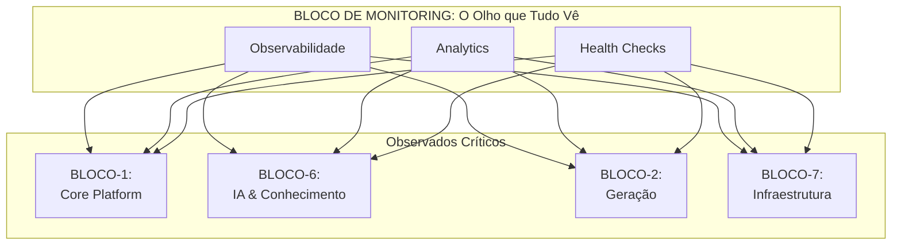

# 📘 **BLUEPRINT EXECUTIVO — BLOCO-4 (MONITORING & OBSERVABILITY)**

**STATUS:** Executivo • Versão 1.0 • Foco em Valor de Negócio
**PILAR:** Visibilidade, Performance e Decisão Baseada em Dados
**PÚBLICO-ALVO:** Liderança, Arquitetos, Product Managers, Stakeholders

---

## **⚠️ Atenção: Correção Importante**

O **BLOCO-4** é oficialmente **MONITORING & OBSERVABILITY**, não "Domain Layer". Essa funcionalidade pertence ao **BLOCO-4 (em uma numeração de blocos anterior ou diferente, dependendo da versão do documento).** *Nota: A numeração dos blocos pode variar entre documentos. Este blueprint foca no bloco funcional de Monitoramento, independentemente de seu número final na árvore.*

Este documento aborda o **valor estratégico e o propósito do Bloco de Monitoramento**, que é o sistema nervoso sensorial do ecossistema Hulk.

---

## **1. Visão Estratégica**

O **Bloco de Monitoring & Observability** é o **sistema nervoso central e os órgãos sensoriais** do Hulk. Em um ecossistema autônomo, distribuído e em constante evolução, a capacidade de **ver, entender e reagir** ao que está acontecendo em tempo real é o que separa o sucesso do caos. Sem ele, o Hulk seria um gigante cego, surdo e incapaz de sentir dor.

Ele não apenas coleta métricas; ele **transforma dados brutos em inteligência acionável**. Sua existência responde à pergunta: *Como podemos gerenciar o que não podemos ver? Como podemos garantir a saúde e a performance de um sistema que se auto-modifica?* Este bloco é a resposta, fornecendo a clareza necessária para operar com confiança em um ambiente de extrema complexidade.

---

## **2. Propósito Central**

O Bloco de Monitoring existe para ser a **fonte única da verdade sobre a saúde e o comportamento do sistema**. Sua missão é quádrupla:

1.  **Prover Visibilidade Completa:** Oferecer uma visão 360 graus e em tempo real de todos os componentes, desde a infraestrutura mais baixa até as interações de mais alto nível da IA.
2.  **Habilitar a Decisão Rápida:** Transformar sinais complexos em dashboards, alertas e insights claros, permitindo que humanos e sistemas tomem decisões informadas em segundos, não horas.
3.  **Garantir a Experiência do Usuário:** Monitorar ativamente a performance e a disponibilidade do ponto de vista do cliente, garantindo que problemas sejam detectados e resolvidos antes que impactem o negócio.
4.  **Alimentar a Autonomia:** Fornecer os dados de feedback essenciais para que o próprio Hulk possa se auto-otimizar, se auto-recuperar e aprender com seu próprio comportamento.

---

## **3. Pilares de Capacidade**

O Bloco de Monitoring é estruturado em três pilares que juntos entregam uma visão profunda e acionável do sistema.

| Pilar | Função Executiva | Analogia de Negócio |
| ----- | ---------------- | ------------------- |
| **Observabilidade (Telemetria)** | **Os Sentidos do Sistema.** Coleta todos os sinais (logs, traces, métricas) de forma estruturada. | O **Sistema Nervoso Central**, que capta todos os estímulos do corpo e do ambiente. |
| **Analytics (Inteligência)** | **O Cérebro Analítico.** Processa os sinais brutos para encontrar padrões, anomalias e tendências. | O **Córtex Cerebral**, que interpreta os sinais sensoriais para formar uma compreensão do mundo. |
| **Health Checks (Vitalidade)** | **O Monitor Cardíaco.** Verifica de forma proativa se os componentes estão vivos e saudáveis. | O **Monitor de UTI**, que verifica constantemente os sinais vitais de um paciente. |

---

## **4. Valor de Negócio**

O investimento no Bloco de Monitoring gera retornos diretos em **confiança, eficiência e inteligência**:

### 🛡️ **Resiliência e Confiança Operacional**
*   **Detecção Proativa de Problemas:** Identifica degradações de performance e anomalias antes que se tornem falhas catastróficas, reduzindo o tempo de inatividade (MTTR).
*   **Diagnóstico Rápido:** Reduz o tempo de investigação de horas para minutos, apontando com precisão a causa raiz de um incidente.

### 📈 **Otimização de Custos e Performance**
*   **Identificação de Gargalos:** Revela onde os recursos (CPU, memória, I/O) estão sendo mal utilizados, permitindo otimizações que reduzem custos de infraestrutura.
*   **Melhoria da Experiência do Usuário:** Ao monitorar a performance do lado do cliente, podemos identificar e corrigir lentidões que afetam a satisfação e a conversão.

### 🧠 **Inteligência de Negócio e Inovação**
*   **Dados para a IA:** Fornece o feedback loop (loop de realimentação) essencial para que o Bloco de IA aprenda, se ajuste e melhore suas previsões e gerações.
*   **Insights sobre o Uso:** Entende como os usuários e os sistemas interagem com o Hulk, informando decisões de produto e roadmap.

### ⚡ **Habilitação da Autonomia**
*   **Base para a Auto-Recuperação:** Os alertas e as métricas de saúde são os gatilhos que permitem ao sistema executar ações corretivas automáticas (reiniciar um serviço, escalar um recurso, etc.).
*   **Alimentação do Aprendizado:** Os dados de observabilidade são o "combustível" para que o sistema evolua e se torne mais eficiente com o tempo.

---

## **5. Fluxo de Valor Simplificado**

O processo de negócio orquestrado pelo Bloco de Monitoring transforma dados brutos em ação inteligente.

```mermaid
flowchart LR
    A[Sistema em Operação] --> B{<b>Observabilidade</b><br>(Logs, Traces, Métricas)}
    B --> C{<b>Analytics</b><br>(Padrões, Anomalias)}
    C --> D{<b>Health Checks</b><br>(Alertas, Dashboards)}
    D --> E[<b>Decisão Humana</b><br>(Intervenção, Planejamento)]
    D --> F[<b>Ação Autônoma</b><br>(Auto-Recuperação, Otimização)]
    E --> G[<b>Sistema Mais Saudável e Eficiente</b>]
    F --> G
```

---

## **6. Posicionamento no Ecossistema Hulk**

O Bloco de Monitoring é o **observador onipresente** que ilumina e informa a todos os outros blocos.



---

## **7. Conclusão e Próximos Passos**

O **Bloco de Monitoring & Observability é o que nos dá a coragem para sermos ambiciosos**. É ele que nos permite construir um sistema autônomo, gerado por IA e de alta complexidade, sabendo que temos a visibilidade necessária para mantê-lo sob controle. Sem ele, a inovação seria um salto no escuro. Com ele, é um passo calculado e seguro.

**Próximos Passos Recomendados:**
1.  **Definir os KPIs Críticos:** Estabelecer quais são as métricas de negócio e técnicas que realmente importam para o sucesso do Hulk.
2.  **Implementar o Pilar de Observabilidade:** Garantir que todos os componentes emitam logs estruturados, traces e métricas padrão.
3.  **Construir Dashboards Executivos:** Criar visualizações que traduzam a saúde técnica em impacto de negócio para a liderança.

---

**APROVADO POR:** Arquitetura Estratégica Hulk
**DATA:** 2023-11-15
**VERSÃO:** 1.0