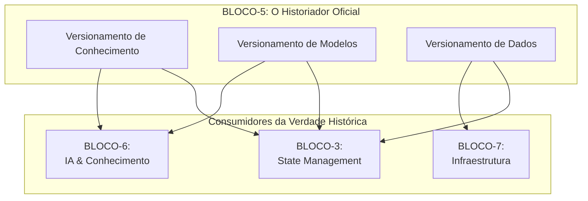

# 📘 **BLUEPRINT EXECUTIVO — BLOCO-5 (VERSIONING & MIGRATION)**

**STATUS:** Executivo • Versão 1.0 • Foco em Valor de Negócio
**PILAR:** Governança, Evolução Controlada e Segurança Temporal
**PÚBLICO-ALVO:** Liderança, Arquitetos, Product Managers, Stakeholders

---

## **⚠️ Atenção: Correção Importante**

O **BLOCO-5** é oficialmente **VERSIONING & MIGRATION (Versionamento e Migração)**, não "State Management". Essa funcionalidade pertence ao **BLOCO-3**.

Este documento aborda o **valor estratégico e o propósito do Bloco-5**, que é o sistema nervoso que permite ao Hulk evoluir de forma segura, rastreável e sem medo de regressões.

---

## **1. Visão Estratégica**

O **Bloco-5** é a **máquina do tempo e o arquivista central** do ecossistema Hulk. Em um ambiente dinâmico onde IA gera código, modelos são atualizados constantemente e dados migram para novas estruturas, a capacidade de **controlar, reverter e auditar cada mudança** não é um luxo, mas uma necessidade de sobrevivência.

Ele não gerencia o estado atual do sistema (isso é papel do Bloco-3), mas sim a **linha do tempo de como chegamos até aqui**. Sua existência responde à pergunta: *Como podemos inovar e evoluir a uma velocidade alucinante, sem o risco de quebrar o que já funciona ou perder o que já foi construído?* O Bloco-5 é a rede de segurança que nos permite correr mais rápido.

---

## **2. Propósito Central**

O Bloco-5 existe para ser o **guardião da evolução segura e controlada** de todo o ecossistema. Sua missão é quádrupla:

1.  **Governar a Evolução:** Prover um processo formal e auditável para que qualquer ativo crítico (modelo, conhecimento, dado) possa evoluir de uma versão para a outra.
2.  **Prover Segurança Temporal:** Garantir a capacidade de "voltar no tempo" (rollback) de forma instantânea e determinística para qualquer versão anterior, mitigando o impacto de falhas em produção.
3.  **Garantir a Rastreabilidade Absoluta:** Manter um registro imutável de quem mudou o quê, quando, por quê e qual foi o impacto. Essencial para auditoria, depuração e aprendizado.
4.  **Habilitar a Inovação Segura:** Criar um ambiente onde experimentar (A/B testing, canary releases) é seguro, pois qualquer resultado negativo pode ser revertido sem consequências permanentes.

---

## **3. Pilares de Capacidade**

O Bloco-5 é estruturado em três pilares que governam os principais ativos dinâmicos do Hulk.

| Pilar | Função Executiva | Analogia de Negócio |
| ----- | ---------------- | ------------------- |
| **Versionamento do Conhecimento** | **A Biblioteca de Alexandria Versionada.** Controla cada versão da base de conhecimento da IA (documentos, embeddings, grafos). | O **Arquivo Histórico** que preserva cada edição de uma enciclopédia, permitindo comparar e restaurar qualquer versão. |
| **Versionamento de Modelos** | **O Laboratório e Controle de Qualidade de IA.** Gerencia o ciclo de vida dos modelos de IA, desde o treinamento até o deploy e o A/B testing. | O **Departamento de P&D** que testa novas fórmulas, as valida e só as libera para produção após aprovação rigorosa. |
| **Versionamento de Dados** | **O Cartório de Registros de Dados.** Controla as migrações de schema e a linhagem dos dados, garantindo integridade e conformidade. | O **Cartório de Imóveis** que registra cada alteração na estrutura de uma propriedade, garantindo um histórico legal e inquestionável. |

---

## **4. Valor de Negócio**

O investimento no Bloco-5 gera retornos diretos em **confiança, velocidade e governança**:

### 🛡️ **Redução Drástica de Risco Operacional**
*   **Rollback Imediato:** Um novo modelo de IA está degradando a experiência do usuário? Um rollback para a versão anterior pode ser feito em minutos, não em horas ou dias.
*   **Integridade de Dados Garantida:** Migrações de schema que falham no meio do processo podem ser revertidas, evitando corrupção de dados e perdas financeiras.

### 🚀 **Aceleração do Ciclo de Inovação em IA**
*   **Experimentação sem Medo:** A/B testing e canary releases tornam-se triviais, permitindo que a equipe de IA itere e melhore os modelos em um ritmo muito mais rápido.
*   **Deploy Contínuo de Inteligência:** Novas capacidades de IA podem ser entregues à produção de forma gradual e segura, em vez de grandes e arriscados lançamentos.

### 📊 **Governança e Conformidade (Compliance) Robustas**
*   **Auditoria Infalível:** Para regulamentações como LGPD ou SOX, a capacidade de provar o estado exato do sistema em qualquer ponto no tempo é um diferencial crítico.
*   **Linhagem de Dados Completa:** Rastreia a origem e as transformações de cada dado, essencial para explicar decisões de IA e garantir a qualidade dos insights.

### 💡 **Confiança e Autonomia para as Equipes**
*   **Desenvolvimento Psicológico Seguro:** Saber que há uma rede de segurança robusta encoraja as equipes a assumir riscos calculados e a inovar mais.
*   **Menos Medo, Mais Foco:** As equipes gastam menos tempo se preocupando com "e se der errado?" e mais tempo resolvendo problemas de alto valor.

---

## **5. Fluxo de Valor Simplificado**

O processo de negócio orquestrado pelo Bloco-5 transforma a mudança de um risco em um ativo controlado.

```mermaid
flowchart TD
    A[Mudança Proposta<br>(Novo Modelo, Dado, Conhecimento)] --> B{<b>BLOCO-5:<br>Versionamento & Migração</b>}
    B --> C[<b>1. Versionar</b><br>(Criar Nova Versão)]
    C --> D[<b>2. Testar/Validar</b><br>(A/B, Canary)]
    D --> E{Resultado OK?}
    E -- Sim --> F[<b>3. Promover</b><br>(Tornar Padrão)]
    E -- Não --> G[<b>4. Rollback</b><br>(Reverter para Anterior)]
    F --> H[<b>Inovação em Produção</b>]
    G --> I[<b>Sistema Estável</b><br>(Sem Impacto Negativo)]
```

---

## **6. Posicionamento no Ecossistema Hulk**

O Bloco-5 é o **historiador oficial** que alimenta e controla a evolução de outros blocos críticos.



---

## **7. Conclusão e Próximos Passos**

O **Bloco-5 é o pilar da maturidade**. Ele transforma o Hulk de um sistema ágil para um sistema **resiliente e governado**. Em um mundo onde a mudança é a única constante, a capacidade de gerenciá-la de forma segura é o que separa as plataformas que sobrevivem das que prosperam.

**Próximos Passos Recomendados:**
1.  **Definir Políticas de Versionamento:** Estabelecer o que precisa ser versionado, por quanto tempo e quais são os critérios de promoção.
2.  **Implementar o Motor de Migração de Dados:** É o pilar mais crítico para a estabilidade operacional imediata.
3.  **Desenvolver o Pipeline de A/B Testing para Modelos:** Habilitar a inovação segura no pilar de IA, que é o maior diferencial competitivo.

---

**APROVADO POR:** Arquitetura Estratégica Hulk
**DATA:** 2023-11-15
**VERSÃO:** 1.0