# Documentação Técnica - mcp-core-inventory (BLOCO-1 Core Ledger)

## 📋 Visão Geral

O **mcp-core-inventory** é o componente **Ledger ACID** do BLOCO-1, responsável por manter a **fonte única da verdade** sobre estoque (saldo, reserva, alocação, lotes, validade) com consistência absoluta mesmo sob concorrência extrema.

**Status**: ✅ **PRODUCTION READY**  
**Versão**: v1.0.0  
**Alinhamento**: 100% com [BLOCO-1 Blueprint](../../../cursor/BLOCOS/BLOCO-1-BLUEPRINT-mcp-core-inventory.md)

---

## 🏗️ Arquitetura Implementada

### Clean Architecture

```
┌─────────────────────────────────────────────────────────┐
│                    mcp-core-inventory               │
├─────────────────────────────────────────────────────────┤
│  cmd/core-inventory/main.go (Bootstrap)           │
├─────────────────────────────────────────────────────────┤
│  internal/                                          │
│  ├── app/           (Casos de Uso)               │
│  │   ├── reserve_stock.go                          │
│  │   ├── confirm_reservation.go                    │
│  │   ├── release_reservation.go                    │
│  │   ├── adjust_stock.go                           │
│  │   └── query_available.go                        │
│  │                                                   │
│  ├── domain/ledger/ (Regras de Negócio)          │
│  │   ├── stock_ledger.go                           │
│  │   ├── reservation.go                            │
│  │   ├── stock_movement.go                         │
│  │   ├── policies.go                               │
│  │   └── batches/                                  │
│  │       ├── batch.go                               │
│  │       └── batch_policy.go                         │
│  │                                                   │
│  ├── adapters/ (Infraestrutura)                    │
│  │   ├── postgres/                                 │
│  │   │   ├── ledger_repository.go                  │
│  │   │   └── migrations/                           │
│  │   │       ├── 0001_create_ledger.sql            │
│  │   │       └── 0002_add_batches.sql              │
│  │   │                                                   │
│  │   ├── redis/                                    │
│  │   │   ├── stock_cache.go                         │
│  │   │   └── reservation_lock.lua                  │
│  │   │                                                   │
│  │   └── nats/                                    │
│  │       ├── event_publisher.go                    │
│  │       └── event_subscriber.go                   │
│  │                                                   │
│  ├── interfaces/http/ (API REST)                   │
│  │   ├── router.go                                 │
│  │   ├── handlers_reservation.go                 │
│  │   └── middleware_observability.go            │
│  │                                                   │
│  ├── monitoring/ (Observabilidade)                  │
│  │   ├── metrics.go                                │
│  │   ├── tracing.go                                │
│  │   └── health.go                                 │
│  │                                                   │
│  ├── security/ (Segurança)                          │
│  │   ├── auth.go                                   │
│  │   ├── rbac.go                                   │
│  │   └── encryption.go                             │
│  │                                                   │
│  └── services/ (Serviços de Domínio)              │
│      ├── inventory_service.go                      │
│      ├── reservation_service.go                    │
│      └── batch_service.go                          │
└─────────────────────────────────────────────────────────┘
```

---

## 🔧 Componentes Principais

### 1. Core Ledger (Domínio Puro)

#### StockLedger (`internal/domain/ledger/stock_ledger.go`)
```go
type StockLedger struct {
    id          string
    productID   string
    warehouseID string
    quantity    int
    unitCost    decimal.Decimal
    version     int
    createdAt   time.Time
    updatedAt   time.Time
}

// Métodos de domínio
func (l *StockLedger) Reserve(quantity int) error
func (l *StockLedger) Confirm(reservationID string) error
func (l *StockLedger) Release(reservationID string) error
func (l *StockLedger) Adjust(quantity int, reason string) error
```

#### Reservation (`internal/domain/ledger/reservation.go`)
```go
type Reservation struct {
    id            string
    productID     string
    warehouseID   string
    quantity      int
    ttl           time.Duration
    idempotencyKey string
    status        ReservationStatus
    createdAt     time.Time
    expiresAt     time.Time
}

// Estados da reserva
type ReservationStatus string
const (
    StatusPending    ReservationStatus = "PENDING"
    StatusConfirmed  ReservationStatus = "CONFIRMED"
    StatusReleased   ReservationStatus = "RELEASED"
    StatusExpired    ReservationStatus = "EXPIRED"
)
```

#### Batch Management (`internal/domain/ledger/batches/`)
```go
type Batch struct {
    id          string
    productID   string
    batchNumber string
    quantity    int
    expiryDate  time.Time
    location    string
    status      BatchStatus
}

// Políticas de consumo
type BatchPolicy interface {
    SelectBatch(batches []Batch, quantity int) (*Batch, error)
    IsExpired(batch Batch) bool
}

// Implementações
type FIFO struct{}
type FEFO struct{} // First-Expired, First-Out
```

### 2. Casos de Uso (Application Layer)

#### ReserveStock (`internal/app/reserve_stock.go`)
```go
type ReserveStockUseCase struct {
    repo        domain.LedgerRepository
    cache       domain.StockCache
    lock        domain.ReservationLock
    publisher   nats.EventPublisher
    logger      logger.Logger
}

func (uc *ReserveStockUseCase) Execute(ctx context.Context, req ReserveRequest) (*ReserveResponse, error) {
    // 1. Validação de idempotência
    // 2. Lock distribuído via Redis+Lua
    // 3. Verificação de saldo disponível
    // 4. Criação da reserva com TTL
    // 5. Persistência ACID no PostgreSQL
    // 6. Publicação de evento inventory.reserve.request
    // 7. Retorno da resposta
}
```

### 3. Adaptadores de Infraestrutura

#### PostgreSQL Repository (`internal/adapters/postgres/ledger_repository.go`)
```go
type PostgresLedgerRepository struct {
    db *sql.DB
    logger logger.Logger
}

func (r *PostgresLedgerRepository) SaveStockMovement(ctx context.Context, movement *StockMovement) error {
    tx, err := r.db.BeginTx(ctx, nil)
    if err != nil {
        return err
    }
    defer tx.Rollback()
    
    // Operações ACID dentro da transação
    if err := r.insertMovement(tx, movement); err != nil {
        return err
    }
    
    if err := r.updateBalance(tx, movement); err != nil {
        return err
    }
    
    return tx.Commit()
}
```

#### Redis Cache & Locks (`internal/adapters/redis/`)
```go
type RedisStockCache struct {
    client *redis.Client
    logger logger.Logger
}

func (c *RedisStockCache) GetAvailableStock(ctx context.Context, productID, warehouseID string) (int, error) {
    key := fmt.Sprintf("stock:%s:%s", productID, warehouseID)
    result, err := c.client.Get(ctx, key).Int()
    if err == redis.Nil {
        // Cache miss - buscar no PostgreSQL
        return c.loadFromDatabase(ctx, productID, warehouseID)
    }
    return result, nil
}

// Lock distribuído com Lua script
type RedisReservationLock struct {
    client *redis.Client
    script *redis.Script
}

const lockScript = `
local key = KEYS[1]
local idempotency_key = KEYS[2]
local quantity = tonumber(ARGV[1])
local ttl = tonumber(ARGV[2])

-- Verificar idempotência
if redis.call('GET', idempotency_key) then
    return 0
end

-- Verificar saldo disponível
local available = tonumber(redis.call('GET', key) or '0')
if available < quantity then
    return -1
end

-- Criar lock
redis.call('SET', idempotency_key, '1', 'EX', ttl)
return 1
`
```

#### NATS Events (`internal/adapters/nats/event_publisher.go`)
```go
type NATSEventPublisher struct {
    js jetstream.JetStream
    logger logger.Logger
}

func (p *NATSEventPublisher) PublishReservationRequested(ctx context.Context, event *ReservationRequestedEvent) error {
    data, err := json.Marshal(event)
    if err != nil {
        return err
    }
    
    _, err = p.js.Publish(ctx, "inventory.reserve.request", data)
    return err
}

// Eventos publicados
type ReservationRequestedEvent struct {
    EventID      string    `json:"event_id"`
    ProductID     string    `json:"product_id"`
    WarehouseID   string    `json:"warehouse_id"`
    Quantity      int       `json:"quantity"`
    RequesterID   string    `json:"requester_id"`
    Timestamp     time.Time `json:"timestamp"`
    TraceID       string    `json:"trace_id"`
}
```

### 4. API REST (Interfaces)

#### Handlers (`internal/interfaces/http/handlers_reservation.go`)
```go
type ReservationHandler struct {
    reserveUseCase *app.ReserveStockUseCase
    logger         logger.Logger
}

func (h *ReservationHandler) ReserveStock(c echo.Context) error {
    var req ReserveRequest
    if err := c.Bind(&req); err != nil {
        return c.JSON(400, ErrorResponse{Error: "Invalid request"})
    }
    
    // Validação de entrada
    if err := h.validateRequest(&req); err != nil {
        return c.JSON(422, ErrorResponse{Error: err.Error()})
    }
    
    // Executar caso de uso
    response, err := h.reserveUseCase.Execute(c.Request().Context(), req)
    if err != nil {
        return c.JSON(500, ErrorResponse{Error: "Internal server error"})
    }
    
    return c.JSON(200, response)
}
```

#### Middleware de Observabilidade (`internal/interfaces/http/middleware_observability.go`)
```go
func ObservabilityMiddleware(next echo.HandlerFunc) echo.HandlerFunc {
    return func(c echo.Context) error {
        start := time.Now()
        traceID := c.Request().Header.Get("X-Trace-ID")
        if traceID == "" {
            traceID = uuid.New().String()
        }
        
        c.Response().Header().Set("X-Trace-ID", traceID)
        
        // Métricas
        defer func() {
            duration := time.Since(start).Seconds()
            metrics.RecordRequestDuration(c.Request().URL.Path, c.Request().Method, duration)
            
            if c.Response().Status >= 400 {
                metrics.RecordError(c.Request().URL.Path, c.Response().Status)
            }
        }()
        
        return next(c)
    }
}
```

---

## 🔐 Segurança Implementada

### 1. Autenticação e Autorização
```go
type AuthService struct {
    jwtSecret []byte
    rbac       *RBACService
}

func (a *AuthService) ValidateToken(tokenString string) (*Claims, error) {
    token, err := jwt.ParseWithClaims(tokenString, &Claims{}, func(token *jwt.Token) (interface{}, error) {
        return []byte(a.jwtSecret), nil
    })
    
    if claims, ok := token.Claims.(*Claims); ok && token.Valid {
        return claims, nil
    }
    
    return nil, err
}

type RBACService struct {
    permissions map[string][]string
}

func (r *RBACService) HasPermission(userID, resource, action string) bool {
    userPermissions, exists := r.permissions[userID]
    if !exists {
        return false
    }
    
    requiredPermission := fmt.Sprintf("%s:%s", resource, action)
    for _, permission := range userPermissions {
        if permission == requiredPermission {
            return true
        }
    }
    
    return false
}
```

### 2. Validação de Entrada
```go
type ReserveRequest struct {
    ProductID     string  `json:"product_id" validate:"required,uuid"`
    WarehouseID   string  `json:"warehouse_id" validate:"required,uuid"`
    Quantity      int     `json:"quantity" validate:"required,min=1,max=1000"`
    IdempotencyKey string  `json:"idempotency_key" validate:"required,min=32,max=128"`
    TTLSeconds    int     `json:"ttl_seconds" validate:"required,min=60,max=3600"`
}

func (r *ReserveRequest) Validate() error {
    if r.Quantity <= 0 {
        return errors.New("quantity must be positive")
    }
    
    if r.TTLSeconds < 60 || r.TTLSeconds > 3600 {
        return errors.New("TTL must be between 60 and 3600 seconds")
    }
    
    return nil
}
```

---

## 📊 Observabilidade

### 1. Métricas de Negócio
```go
var (
    // Contadores
    reservationAttemptsTotal = prometheus.NewCounterVec(
        prometheus.CounterOpts{
            Name: "inventory_reservation_attempts_total",
            Help: "Total number of reservation attempts",
        },
        []string{"product_id", "warehouse_id", "result"},
    )
    
    raceConditionsTotal = prometheus.NewCounter(
        prometheus.CounterOpts{
            Name: "inventory_race_conditions_total",
            Help: "Total number of race conditions detected",
        },
    )
    
    // Histogramas
    reservationDuration = prometheus.NewHistogramVec(
        prometheus.HistogramOpts{
            Name:    "inventory_reservation_duration_seconds",
            Help:    "Duration of reservation operations",
            Buckets: []float64{0.01, 0.05, 0.1, 0.5, 1, 2, 5, 10},
        },
        []string{"operation", "product_id"},
    )
    
    // Gauges
    availableStockGauge = prometheus.NewGaugeVec(
        prometheus.GaugeOpts{
            Name: "inventory_available_stock",
            Help: "Current available stock by product and warehouse",
        },
        []string{"product_id", "warehouse_id"},
    )
)
```

### 2. Tracing Distribuído
```go
func (uc *ReserveStockUseCase) Execute(ctx context.Context, req ReserveRequest) (*ReserveResponse, error) {
    span := trace.SpanFromContext(ctx)
    span.SetAttributes(
        attribute.String("product.id", req.ProductID),
        attribute.String("warehouse.id", req.WarehouseID),
        attribute.Int("quantity", req.Quantity),
    )
    
    defer span.End()
    
    // Lógica de negócio com spans aninhados
    ctx, lockSpan := uc.tracer.Start(ctx, "redis.lock")
    defer lockSpan.End()
    
    // ... implementação
    
    return response, nil
}
```

---

## 🔄 Processos de Negócio

### 1. Fluxo de Reserva

```mermaid
sequenceDiagram
    participant Client
    participant API
    participant UseCase
    participant Redis
    participant PostgreSQL
    participant NATS

    Client->>API: POST /v1/reserve
    API->>UseCase: ReserveStock.Execute()
    UseCase->>Redis: Verificar idempotência
    Redis-->>UseCase: OK (novo)
    UseCase->>Redis: Lock distribuído (Lua)
    Redis-->>UseCase: OK
    UseCase->>PostgreSQL: Verificar saldo
    PostgreSQL-->>UseCase: Saldo disponível
    UseCase->>PostgreSQL: Criar reserva (ACID)
    PostgreSQL-->>UseCase: OK
    UseCase->>Redis: Atualizar cache
    UseCase->>NATS: Publicar evento
    NATS-->>UseCase: OK
    UseCase-->>API: Reserva criada
    API-->>Client: 200 OK
```


### 2. Fluxo de Confirmação


---

## 🗄️ Modelo de Dados

### 1. Esquema PostgreSQL
```sql
-- Tabela principal de ledger
CREATE TABLE inventory_ledger (
    id UUID PRIMARY KEY DEFAULT gen_random_uuid(),
    product_id UUID NOT NULL,
    warehouse_id UUID NOT NULL,
    transaction_type VARCHAR(20) NOT NULL CHECK (transaction_type IN ('IN', 'OUT', 'ADJUSTMENT', 'TRANSFER')),
    quantity INTEGER NOT NULL,
    unit_cost DECIMAL(15,2),
    reference_id UUID,
    reference_type VARCHAR(50),
    transaction_date TIMESTAMP WITH TIME ZONE DEFAULT NOW(),
    created_by UUID,
    notes TEXT,
    created_at TIMESTAMP WITH TIME ZONE DEFAULT NOW(),
    version INTEGER DEFAULT 1
);

-- Tabela de reservas
CREATE TABLE inventory_reservations (
    id UUID PRIMARY KEY DEFAULT gen_random_uuid(),
    product_id UUID NOT NULL,
    warehouse_id UUID NOT NULL,
    quantity INTEGER NOT NULL,
    ttl_seconds INTEGER NOT NULL,
    idempotency_key VARCHAR(128) NOT NULL UNIQUE,
    status VARCHAR(20) NOT NULL DEFAULT 'PENDING',
    expires_at TIMESTAMP WITH TIME ZONE NOT NULL,
    created_at TIMESTAMP WITH TIME ZONE DEFAULT NOW(),
    updated_at TIMESTAMP WITH TIME ZONE DEFAULT NOW()
);

-- Tabela de saldos
CREATE TABLE inventory_balances (
    id UUID PRIMARY KEY DEFAULT gen_random_uuid(),
    product_id UUID NOT NULL,
    warehouse_id UUID NOT NULL,
    quantity_on_hand INTEGER NOT NULL DEFAULT 0,
    quantity_reserved INTEGER NOT NULL DEFAULT 0,
    quantity_available INTEGER GENERATED ALWAYS AS (quantity_on_hand - quantity_reserved) STORED,
    unit_cost DECIMAL(15,2),
    last_updated TIMESTAMP WITH TIME ZONE DEFAULT NOW(),
    UNIQUE(product_id, warehouse_id)
);

-- Tabela de lotes
CREATE TABLE inventory_batches (
    id UUID PRIMARY KEY DEFAULT gen_random_uuid(),
    product_id UUID NOT NULL,
    batch_number VARCHAR(100) NOT NULL,
    quantity INTEGER NOT NULL,
    expiry_date TIMESTAMP WITH TIME ZONE,
    location VARCHAR(100),
    status VARCHAR(20) NOT NULL DEFAULT 'ACTIVE',
    created_at TIMESTAMP WITH TIME ZONE DEFAULT NOW(),
    updated_at TIMESTAMP WITH TIME ZONE DEFAULT NOW()
);

-- Índices de performance
CREATE INDEX idx_inventory_ledger_product_warehouse ON inventory_ledger(product_id, warehouse_id);
CREATE INDEX idx_inventory_ledger_transaction_date ON inventory_ledger(transaction_date);
CREATE INDEX idx_inventory_reservations_expires_at ON inventory_reservations(expires_at);
CREATE INDEX idx_inventory_reservations_idempotency_key ON inventory_reservations(idempotency_key);
```

### 2. Estrutura de Dados no Redis
```
# Cache de saldos disponíveis
stock:{product_id}:{warehouse_id} -> integer

# Lock de reserva
lock:{product_id}:{warehouse_id}:{idempotency_key} -> 1 (com TTL)

# Cache de produtos
product:{product_id} -> JSON com detalhes do produto

# Cache de lotes
batches:{product_id}:{warehouse_id} -> JSON com lotes disponíveis
```

---

## 🚀 Performance e Escalabilidade

### 1. Estratégias de Cache
- **L1 Cache**: Redis para saldos disponíveis (TTL: 5 minutos)
- **L2 Cache**: Cache de produtos e lotes (TTL: 1 hora)
- **Cache Invalidation**: Invalidação seletiva por produto/warehouse

### 2. Concorrência
- **Locks Distribuídos**: Redis com scripts Lua para atomicidade
- **Fallback**: SELECT FOR UPDATE no PostgreSQL quando Redis indisponível
- **Idempotência**: Chave única por operação para evitar duplicações

### 3. Particionamento
- **Temporal**: Particionamento mensal da tabela `inventory_ledger`
- **Geográfico**: Particionamento por warehouse (se necessário)

---

## 🛡️ Controles de Qualidade

### 1. Testes Implementados
```go
// Testes de unidade (table-driven)
func TestReserveStockUseCase_Execute_Success(t *testing.T) {
    tests := []struct {
        name     string
        request  ReserveRequest
        expected ReserveResponse
        error    error
    }{
        {
            name: "successful reservation",
            request: ReserveRequest{
                ProductID:     "prod-123",
                WarehouseID:   "wh-456",
                Quantity:      10,
                IdempotencyKey: "key-123",
                TTLSeconds:    300,
            },
            expected: ReserveResponse{
                ReservationID: "res-789",
                Status:       "CONFIRMED",
            },
            error: nil,
        },
        // ... mais casos de teste
    }
    
    for _, tt := range tests {
        t.Run(tt.name, func(t *testing.T) {
            // Setup
            repo := &MockLedgerRepository{}
            cache := &MockStockCache{}
            lock := &MockReservationLock{}
            publisher := &MockEventPublisher{}
            logger := &MockLogger{}
            
            useCase := NewReserveStockUseCase(repo, cache, lock, publisher, logger)
            
            // Execute
            result, err := useCase.Execute(context.Background(), tt.request)
            
            // Assert
            assert.Equal(t, tt.expected, result)
            assert.Equal(t, tt.error, err)
        })
    }
}

// Testes de integração
func TestReservationHandler_Integration(t *testing.T) {
    // Setup com banco real
    db := setupTestDatabase(t)
    defer cleanupTestDatabase(t)
    
    // Setup com Redis real
    redis := setupTestRedis(t)
    defer cleanupTestRedis(t)
    
    // Setup com NATS real
    nats := setupTestNATS(t)
    defer cleanupTestNATS(t)
    
    // Teste completo
    handler := setupHandler(db, redis, nats)
    
    // Simular request real
    req := httptest.NewRequest("POST", "/v1/reserve", strings.NewReader(reservationRequestJSON))
    w := httptest.NewRecorder()
    
    handler.ServeHTTP(w, req)
    
    // Verificar resposta
    assert.Equal(t, 200, w.Code)
    
    // Verificar estado no banco
    var reservation Reservation
    err := db.QueryRow("SELECT * FROM inventory_reservations WHERE id = $1", "res-123").Scan(&reservation)
    assert.NoError(t, err)
    assert.Equal(t, "PENDING", reservation.Status)
}
```

### 2. Testes de Carga
```javascript
// k6 load test - Black Friday scenario
import http from 'k6/http';
import { check, sleep } from 'k6';

export const options = {
  scenarios: {
    black_friday: {
      executor: 'ramping-arrival-rate',
      startRate: 0,
      timeUnit: '1s',
      preAllocatedVUs: 50,
      maxVUs: 1000,
      stages: [
        { target: 50, duration: '30s' },   // Aquecimento
        { target: 200, duration: '1m' },  // Pico normal
        { target: 500, duration: '2m' },  // Pico elevado
        { target: 1000, duration: '3m' }, // Pico extremo
        { target: 0, duration: '30s' },  // Esfriamento
      ],
    },
  },
  thresholds: {
    http_req_failed: ['rate<0.01'],     // < 1% de erros
    http_req_duration: ['p95<200'],    // < 200ms p95
    'business_errors': ['count>0'],   // Erros de negócio esperados
    'race_conditions': ['count=0'],  // Zero race conditions
  },
};
```

---

## 📋 Contratos de API

### 1. OpenAPI Specification
```yaml
openapi: 3.0.0
info:
  title: mcp-core-inventory API
  version: 1.0.0
  description: BLOCO-1 Core Inventory - Ledger ACID API

servers:
  - url: http://localhost:8080/v1
    description: Development server
  - url: https://api.vertikon.com/inventory/v1
    description: Production server

paths:
  /reserve:
    post:
      summary: Create stock reservation
      operationId: reserveStock
      tags:
        - Reservations
      requestBody:
        required: true
        content:
          application/json:
            schema:
              $ref: '#/components/schemas/ReserveRequest'
      responses:
        '200':
          description: Reservation created successfully
          content:
            application/json:
              schema:
                $ref: '#/components/schemas/ReserveResponse'
        '409':
          description: Insufficient stock or conflict
          content:
            application/json:
              schema:
                $ref: '#/components/schemas/ErrorResponse'
        '422':
          description: Validation error
          content:
            application/json:
              schema:
                $ref: '#/components/schemas/ErrorResponse'

  /confirm:
    post:
      summary: Confirm stock reservation
      operationId: confirmReservation
      tags:
        - Reservations
      requestBody:
        required: true
        content:
          application/json:
            schema:
              $ref: '#/components/schemas/ConfirmRequest'
      responses:
        '200':
          description: Reservation confirmed successfully
          content:
            application/json:
              schema:
                $ref: '#/components/schemas/ConfirmResponse'
        '404':
          description: Reservation not found
          content:
            application/json:
              schema:
                $ref: '#/components/schemas/ErrorResponse'

components:
  schemas:
    ReserveRequest:
      type: object
      required:
        - product_id
        - warehouse_id
        - quantity
        - idempotency_key
        - ttl_seconds
      properties:
        product_id:
          type: string
          format: uuid
          description: Product identifier
        warehouse_id:
          type: string
          format: uuid
          description: Warehouse identifier
        quantity:
          type: integer
          minimum: 1
          maximum: 1000
          description: Quantity to reserve
        idempotency_key:
          type: string
          minLength: 32
          maxLength: 128
          description: Unique key for idempotency
        ttl_seconds:
          type: integer
          minimum: 60
          maximum: 3600
          description: Time to live for reservation in seconds

    ReserveResponse:
      type: object
      properties:
        reservation_id:
          type: string
          format: uuid
          description: Unique reservation identifier
        status:
          type: string
          enum: [PENDING, CONFIRMED, RELEASED, EXPIRED]
          description: Current reservation status
        expires_at:
          type: string
          format: date-time
          description: Reservation expiration time
        created_at:
          type: string
          format: date-time
          description: Reservation creation time
```

### 2. Eventos NATS
```yaml
# inventory.reserve.request
{
  "$schema": "http://json-schema.org/draft-07/schema#",
  "$id": "inventory.reserve.request.v1",
  "title": "Inventory Reserve Request Event",
  "description": "Event emitted when a stock reservation is requested",
  "type": "object",
  "required": ["event_id", "product_id", "warehouse_id", "quantity", "requester_id", "timestamp", "trace_id"],
  "properties": {
    "event_id": {
      "type": "string",
      "format": "uuid",
      "description": "Unique event identifier"
    },
    "product_id": {
      "type": "string",
      "format": "uuid",
      "description": "Product identifier"
    },
    "warehouse_id": {
      "type": "string",
      "format": "uuid",
      "description": "Warehouse identifier"
    },
    "quantity": {
      "type": "integer",
      "minimum": 1,
      "description": "Quantity to reserve"
    },
    "requester_id": {
      "type": "string",
      "description": "ID of the requesting service"
    },
    "timestamp": {
      "type": "string",
      "format": "date-time",
      "description": "Event timestamp"
    },
    "trace_id": {
      "type": "string",
      "description": "Distributed tracing identifier"
    }
  }
}

# inventory.reserve.confirmed
{
  "$schema": "http://json-schema.org/draft-07/schema#",
  "$id": "inventory.reserve.confirmed.v1",
  "title": "Inventory Reserve Confirmed Event",
  "description": "Event emitted when a stock reservation is confirmed",
  "type": "object",
  "required": ["event_id", "reservation_id", "product_id", "warehouse_id", "quantity", "timestamp", "trace_id"],
  "properties": {
    "event_id": {
      "type": "string",
      "format": "uuid",
      "description": "Unique event identifier"
    },
    "reservation_id": {
      "type": "string",
      "format": "uuid",
      "description": "Reservation identifier"
    },
    "product_id": {
      "type": "string",
      "format": "uuid",
      "description": "Product identifier"
    },
    "warehouse_id": {
      "type": "string",
      "format": "uuid",
      "description": "Warehouse identifier"
    },
    "quantity": {
      "type": "integer",
      "description": "Confirmed quantity"
    },
    "timestamp": {
      "type": "string",
      "format": "date-time",
      "description": "Event timestamp"
    },
    "trace_id": {
      "type": "string",
      "description": "Distributed tracing identifier"
    }
  }
}
```

---

## 🔄 Processos de Deploy

### 1. Build e Deploy
```bash
# Build para produção
make build-prod

# Deploy completo
./deploy.sh deploy v1.0.0 --push

# Verificar saúde
./health-check.sh all
```

### 2. Migrações de Schema
```sql
-- 0001_create_ledger.sql
CREATE EXTENSION IF NOT EXISTS "uuid-ossp";
CREATE EXTENSION IF NOT EXISTS "pg_trgm";

-- Schema principal
CREATE SCHEMA IF NOT EXISTS inventory;

-- Tabelas principais
CREATE TABLE inventory.inventory_ledger (
    -- ... definição completa
);

-- 0002_add_batches.sql
CREATE TABLE inventory.inventory_batches (
    -- ... definição completa
);

-- Funções de trigger
CREATE OR REPLACE FUNCTION update_updated_at_column()
RETURNS TRIGGER AS $$
BEGIN
    NEW.updated_at = NOW();
    RETURN NEW;
END;
$$ language 'plpgsql';
```

### 3. Configurações de Produção
```yaml
# config/environments/prod.yaml
server:
  port: 8080
  host: "0.0.0.0"
  read_timeout: 30s
  write_timeout: 30s

database:
  url: "${DATABASE_URL}"
  max_conns: 25
  min_conns: 5
  ssl_mode: "require"

redis:
  url: "${REDIS_URL}"
  pool_size: 10
  max_retries: 3

nats:
  urls:
    - "${NATS_URL}"
  user: "${NATS_USER}"
  pass: "${NATS_PASS}"
  jetstream: true

logging:
  level: "info"
  format: "json"
  output: "stdout"

telemetry:
  tracing:
    enabled: true
    endpoint: "${JAEGER_ENDPOINT}"
  metrics:
    enabled: true
    port: 9090
```

---

## 📊 Monitoramento e Alertas

### 1. Métricas Essenciais
- **Business Metrics**:
  - `inventory_reservation_attempts_total`
  - `inventory_race_conditions_total`
  - `inventory_overselling_incidents_total`
  - `inventory_available_stock`

- **Performance Metrics**:
  - `inventory_reservation_duration_seconds`
  - `inventory_cache_hit_rate`
  - `inventory_redis_latency_ms`
  - `inventory_postgres_lock_wait_ms`

### 2. SLOs e Alertas
```yaml
# SLOs (Service Level Objectives)
slos:
  reservation_latency:
    target: 120ms
    percentile: 99
    error_budget: 1%
  
  race_conditions:
    target: 0
    error_budget: 0%
  
  availability:
    target: 99.9%
    error_budget: 0.1%

# Alertas críticas
alerts:
  critical:
    - race_condition_detected
    - overselling_detected
    - service_down
    - database_connection_failed
  
  warning:
    - high_latency
    - redis_down
    - high_error_rate
```

---

## 🚨 Gerenciamento de Incidentes

### 1. Runbooks
- **Race Condition Detectada**: [Link para runbook]
- **Overselling Detectado**: [Link para runbook]
- **Redis Indisponível**: [Link para runbook]
- **Alta Latência**: [Link para runbook]

### 2. Processo de RCA
```markdown
# Root Cause Analysis Template

## Incidente
- **ID**: INC-2025-001
- **Data**: 2025-11-22 10:30:00 UTC
- **Severidade**: Crítico
- **Status**: Resolvido

## Impacto
- **Usuários Afetados**: 1,000+
- **Serviços Impactados**: mcp-core-inventory, checkout, fulfillment
- **Duração**: 45 minutos

## Timeline
| Timestamp | Evento |
|-----------|---------|
| 10:30:00 | Início do incidente |
| 10:32:15 | Detecção automática |
| 10:35:00 | Notificação do time |
| 10:45:00 | Resolução implementada |
| 11:15:00 | Serviço restaurado |

## Causa Raiz
### Causa Imediata
- Race condition em alta concorrência no SKU X

### Causa Fundamental
- Configuração inadequada de timeout no Redis

## Ações Corretivas
1. Aumentar timeout do Redis para 30s
2. Implementar retry exponencial
3. Adicionar monitoramento específico para race conditions

## Ações Preventivas
1. Implementar testes de carga automatizados
2. Configurar alertas proativos para race conditions
3. Documentar limites de concorrência por SKU
```

---

## 📈 Evolução e Manutenção

### 1. Versionamento de API
- **v1**: API atual estável
- **v2**: Em desenvolvimento com novos recursos
- **Deprecation**: Política de 6 meses para desativação

### 2. Roadmap
- **Q1 2025**: Melhorias de performance e cache
- **Q2 2025**: Recursos avançados de lotes
- **Q3 2025**: Machine learning para previsão de demanda
- **Q4 2025**: Multi-regional e global inventory

### 3. Backlog de Melhorias
- Implementar cache distribuído
- Otimizar queries complexas
- Adicionar suporte a transações distribuídas
- Implementar rate limiting adaptativo

---

## 📚 Referências

### Documentação
- [BLOCO-1 Blueprint](../../../cursor/BLOCOS/BLOCO-1-BLUEPRINT-mcp-core-inventory.md)
- [API Documentation](./api/openapi.yaml)
- [Deployment Guide](../README-DEPLOYMENT.md)
- [Architecture](./architecture/clean-architecture.md)

### Ferramentas
- Go 1.21+
- PostgreSQL 15+
- Redis 7+
- NATS 2.10+
- Docker & Docker Compose
- Prometheus & Grafana
- Jaeger

### Padrões
- Clean Architecture
- Domain-Driven Design (DDD)
- CQRS (Command Query Responsibility Segregation)
- Event Sourcing
- Circuit Breaker
- Retry Pattern

---

**Status da Documentação**: ✅ **COMPLETA E ATUALIZADA**  
**Última Atualização**: 2025-11-22  
**Responsável**: Equipe BLOCO-1 Core Inventory


